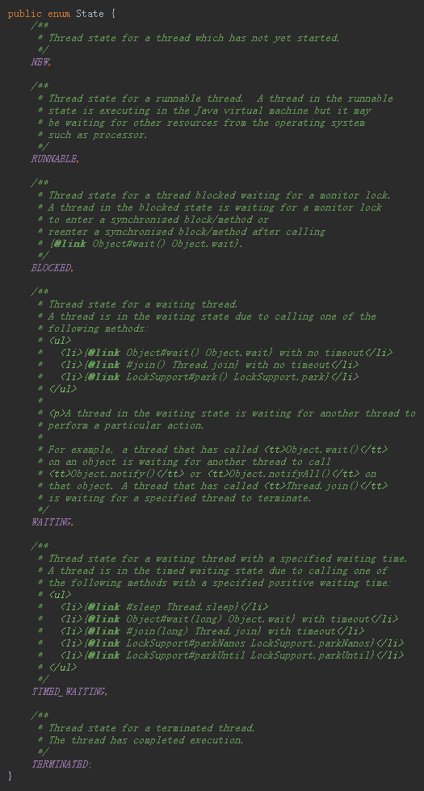

## 并发编程

### 一、什么是juc

#### 1.1 juc简介

在 Java 中，线程部分是一个重点，本篇文章说的 JUC 也是关于线程的。JUC 就是 java.util .concurrent 工具包的简称。这是一个处理线程的工具包，JDK  1.5 开始出现的。

#### 1.2 进程与线程

进程：指在系统中正在运行的一个应用程序；程序一旦运行就是进程；进程— —资源分配的最小单位。 

线程：系统分配处理器时间资源的基本单元，或者说进程之内独立执行的一个 单元执行流。线程——程序执行的最小单位。

#### 1.3 线程的状态

##### 1.3.1 线程状态枚举类

##### 1.3.2  wait/sleep的区别

1. sleep是Thread类的静态方法；wait是Object的方法，任何实例对象都能调用。
2. sleep不会释放锁，它也不需要占用锁。wait会释放锁，但调用它的前提是当前线程占有锁(即代码要做synchronized中)。
3. 它们都可以被interrupted方法中断。

#### 1.4 并发与并行

**并发**：同一时刻多个线程再访问同一资源，多个线程对一个点。

例子：春运抢票 电商秒杀.....

**并行**：多项工作一起执行，之后再汇总

例子：泡方便面------电水壶烧水，一边撕调料包倒入桶中

