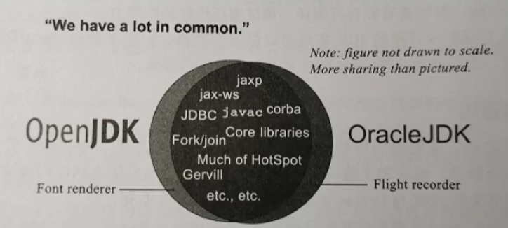
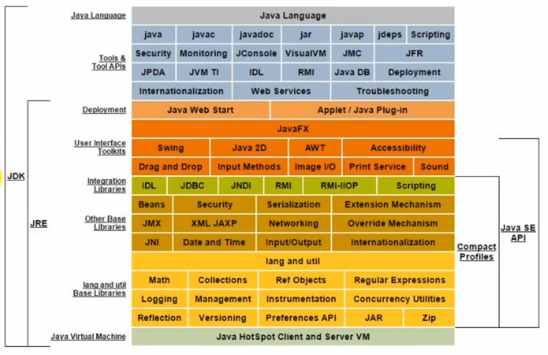

# 1.JVM与Java体系结构


## 1.1. 前言


作为Java工程师的你曾被伤害过吗？你是否也遇到过这些问题？


- 运行着的线上系统突然卡死，系统无法访问，甚至直接OOM

- 想解决线上JVM GC问题，但却无从下手

- 新项目上线，对各种JVM参数设置一脸茫然，直接默认吧然后就JJ了

- 每次面试之前都要重新背一遍JVM的一些原理概念性的东西，然而面试官却经常问你在实际项目中如何调优VM参数，如何解决GC、OOM等问题，一脸懵逼


大部分Java开发人员，除会在项目中使用到与Java平台相关的各种高精尖技术，对于Java技术的核心Java虚拟机了解甚少。


**开发人员如何看待上层框架**


一些有一定工作经验的开发人员，打心眼儿里觉得SSM、微服务等上层技术才是重点，基础技术并不重要，这其实是一种本末倒置的“病态”。


如果我们把核心类库的API比做数学公式的话，那么Java虚拟机的知识就好比公式的推导过程。


计算机系统体系对我们来说越来越远，在不了解底层实现方式的前提下，通过高级语言很容易编写程序代码。但事实上计算机并不认识高级语言


**我们为什么要学习JVM？**


- 面试的需要（BATJ、TMD，PKQ等面试都爱问）

- 中高级程序员必备技能

- - 项目管理、调优的需求

- 追求极客的精神

- - 比如：垃圾回收算法、JIT、底层原理


**Java vs C++**


垃圾收集机制为我们打理了很多繁琐的工作，大大提高了开发的效率，但是，垃圾收集也不是万能的，懂得JVM内部的内存结构、工作机制，是设计高扩展性应用和诊断运行时问题的基础，也是Java工程师进阶的必备能力。

## 1.2. 面向人群及参考书目


## 1.3. Java及JVM简介


**TIOBE语言热度排行榜：**[**index | TIOBE - The Software Quality Company**](https://tiobe.com/tiobe-index/)

| Programming Language | 2021 | 2016 | 2011 | 2006 | 2001 | 1996 | 1991 | 1986 |
| -------------------- | ---- | ---- | ---- | ---- | ---- | ---- | ---- | ---- |
| C                    | 1    | 2    | 2    | 2    | 1    | 1    | 1    | 1    |
| Java                 | 2    | 1    | 1    | 1    | 3    | 26   | -    | -    |
| Python               | 3    | 5    | 6    | 8    | 27   | 19   | -    | -    |
| C++                  | 4    | 3    | 3    | 3    | 2    | 2    | 2    | 8    |
| C#                   | 5    | 4    | 5    | 7    | 13   | -    | -    | -    |
| Visual Basic         | 6    | 13   | -    | -    | -    | -    | -    | -    |
| JavaScript           | 7    | 8    | 10   | 9    | 10   | 32   | -    | -    |
| PHP                  | 8    | 6    | 4    | 4    | 11   | -    | -    | -    |
| SQL                  | 9    | -    | -    | -    | -    | -    | -    | -    |
| R                    | 10   | 17   | 31   | -    | -    | -    | -    | -    |
| Lisp                 | 34   | 27   | 13   | 14   | 17   | 7    | 4    | 2    |
| Ada                  | 36   | 28   | 17   | 16   | 20   | 8    | 5    | 3    |
| (Visual) Basic       | -    | -    | 7    | 6    | 4    | 3    | 3    | 5    |


世界上没有最好的编程语言，只有最适用于具体应用场景的编程语言


**JVM：跨语言的平台**


Java是目前应用最为广泛的软件开发平台之一。随着Java以及Java社区的不断壮大Java 也早已不再是简简单单的一门计算机语言了，它更是一个平台、一种文化、一个社区。


- 作为一个平台，Java虚拟机扮演着举足轻重的作用

- - Groovy、Scala、JRuby、Kotlin等都是Java平台的一部分

- 作为灯种文化，Java几乎成为了“开源”的代名词。

- - 第三方开源软件和框架。如Tomcat、Struts，MyBatis，Spring等。

- - 就连JDK和JVM自身也有不少开源的实现，如openJDK、Harmony。

- 作为一个社区，Java拥有全世界最多的技术拥护者和开源社区支持，有数不清的论坛和资料。从桌面应用软件、嵌入式开发到企业级应用、后台服务器、中间件，都可以看到Java的身影。其应用形式之复杂、参与人数之众多也令人咋舌。


每个语言都需要转换成字节码文件，最后转换的字节码文件都能通过Java虚拟机进行运行和处理


- 随着Java7的正式发布，Java虚拟机的设计者们通过JSR-292规范基本实现在<font style="background:yellow">Java虚拟机平台上运行非Java语言编写的程序</font>。

- Java虚拟机根本不关心运行在其内部的程序到底是使用何种编程语言编写的，<font style="background:yellow">它只关心“字节码”文件</font>。也就是说Java虚拟机拥有语言无关性，并不会单纯地与Java语言“终身绑定”，只要其他编程语言的编译结果满足并包含Java虚拟机的内部指令集、符号表以及其他的辅助信息，它就是一个有效的字节码文件，就能够被虚拟机所识别并装载运行。


**字节码**


- 我们平时说的java字节码，指的是用java语言编译成的字节码。准确的说任何能在jvm平台上执行的字节码格式都是一样的。所以应该统称为：<font style="background:yellow">jvm字节码</font>。

- 不同的编译器，可以编译出相同的字节码文件，字节码文件也可以在不同的JVM上运行。

- Java虚拟机与Java语言并没有必然的联系，它只与特定的二进制文件格式—Class文件格式所关联，Class文件中包含了Java虚拟机指令集（或者称为字节码、Bytecodes）和符号表，还有一些其他辅助信息。


**多语言混合编程**


- <font style="background:yellow">Java平台上的多语言混合编程正成为主流，通过特定领域的语言去解决特定领域的问题是当前软件开发应对日趋复杂的项目需求的一个方向</font>。

- 试想一下，在一个项目之中，并行处理用Clojure语言编写，展示层使用JRuby/Rails，中间层则是Java，每个应用层都将使用不同的编程语言来完成，而且，接口对每一层的开发者都是透明的，各种语言之间的交互不存在任何困难，就像使用自己语言的原生API一样方便，因为它们最终都运行在一个虚拟机之上。

- 对这些运行于Java虚拟机之上、Java之外的语言，来自系统级的、底层的支持正在迅速增强，以JSR-292为核心的一系列项目和功能改进（如Da Vinci Machine项目、Nashorn引擎、InvokeDynamic指令、java.lang.invoke包等），推动Java虚拟机从“Java语言的虚拟机”向 “多语言虚拟机”的方向发展。


**如何真正搞懂JVM？**


Java虚拟机非常复杂，要想真正理解它的工作原理，最好的方式就是自己动手编写一个！


自己动手写一个Java虚拟机，难吗？


天下事有难易乎？


为之，则难者亦易矣；不为，则易者亦难矣


## 1.4. Java发展的重大事件


- 1990年，在Sun计算机公司中，由Patrick Naughton、MikeSheridan及James Gosling领导的小组Green Team，开发出的新的程序语言，命名为oak，后期命名为Java

- 1995年，Sun正式发布Java和HotJava产品，Java首次公开亮相。

- 1996年1月23日，Sun Microsystems发布了JDK 1.0。

- 1998年，JDK1.2版本发布。同时，sun发布了JSP/Servlet、EJB规范，以及将Java分成了J2EE、J2SE和J2ME。这表明了Java开始向企业、桌面应用和移动设备应用3大领域挺进。

- 2000年，JDK1.3发布，Java HotSpot Virtual Machine正式发布，成为Java的默认虚拟机。

- 2002年，JDK1.4发布，古老的Classic虚拟机退出历史舞台。

- 2003年年底，Java平台的Scala正式发布，同年Groovy也加入了Java阵营。

- 2004年，JDK1.5发布。同时JDK1.5改名为JavaSE5.0。

- 2006年，JDK6发布。同年，Java开源并建立了OpenJDK。顺理成章，Hotspot虚拟机也成为了openJDK中的默认虚拟机。

- 2007年，Java平台迎来了新伙伴Clojure。

- 2008年，Oracle收购了BEA，得到了JRockit虚拟机。

- 2009年，Twitter宣布把后台大部分程序从Ruby迁移到Scala，这是Java平台的又一次大规模应用。

- 2010年，Oracle收购了Sun，获得Java商标和最真价值的HotSpot虚拟机。此时，Oracle拥有市场占用率最高的两款虚拟机HotSpot和JRockit，并计划在未来对它们进行整合：HotRockit

- 2011年，JDK7发布。在JDK1.7u4中，正式启用了新的垃圾回收器G1。

- 2017年，JDK9发布。将G1设置为默认Gc，替代CMS

- 同年，IBM的J9开源，形成了现在的Open J9社区

- 2018年，Android的Java侵权案判决，Google赔偿Oracle计88亿美元

- 同年，Oracle宣告JavaEE成为历史名词JDBC、JMS、Servlet赠予Eclipse基金会

- 同年，JDK11发布，LTS版本的JDK，发布革命性的ZGC，调整JDK授权许可

- 2019年，JDK12发布，加入RedHat领导开发的shenandoah GC





在JDK11之前，OracleJDK中还会存在一些OpenJDK中没有的、闭源的功能。但在JDK11中，我们可以认为OpenJDK和OracleJDK代码实质上已经完全一致的程度。


不过，主流的 JDK 8 在2019年01月之后就被宣布停止更新了。另外， JDK 11 及以后的版本也不再提供免费的长期支持（LTS），而且 JDK 15 和 JDK 16 也不是一个长期支持的版本，最新的 JDK 15 只支持 6 个月时间，到 2021 年 3 月，所以千万不要把 JDK 15 等非长期支持版本用在生产。


## 1.5. 虚拟机与Java虚拟机


**虚拟机**


所谓虚拟机（Virtual Machine），就是一台虚拟的计算机。它是一款软件，用来执行一系列虚拟计算机指令。大体上，虚拟机可以分为系统虚拟机和程序虚拟机。


- 大名鼎鼎的Visual Box，Mware就属于系统虚拟机，它们完全是对物理计算机的仿真，提供了一个可运行完整操作系统的软件平台。

- 程序虚拟机的典型代表就是Java虚拟机，它专门为执行单个计算机程序而设计，在Java虚拟机中执行的指令我们称为Java字节码指令。


无论是系统虚拟机还是程序虚拟机，在上面运行的软件都被限制于虚拟机提供的资源中。


**Java虚拟机**


- Java虚拟机是一台执行Java字节码的虚拟计算机，它拥有独立的运行机制，其运行的Java字节码也未必由Java语言编译而成。

- JVM平台的各种语言可以共享Java虚拟机带来的跨平台性、优秀的垃圾回器，以及可靠的即时编译器。

- Java技术的核心就是Java虚拟机（JVM，Java Virtual Machine），因为所有的Java程序都运行在Java虚拟机内部。


作用


- Java虚拟机就是二进制字节码的运行环境，负责装载字节码到其内部，解释/编译为对应平台上的机器指令执行。每一条Java指令，Java虚拟机规范中都有详细定义，如怎么取操作数，怎么处理操作数，处理结果放在哪里。


特点


- 一次编译，到处运行

- 自动内存管理

- 自动垃圾回收功能


**JVM的位置**


JVM是运行在操作系统之上的，它与硬件没有直接的交互



## 1.6. JVM的整体结构


- HotSpot VM是目前市面上高性能虚拟机的代表作之一。

- 它采用解释器与即时编译器并存的架构。

- 在今天，Java程序的运行性能早已脱胎换骨，已经达到了可以和C/C++程序一较高下的地步。

## 1.7. Java代码执行流程


## 1.8. JVM的架构模型

Java编译器输入的指令流基本上是一种基于<font style="background:yellow">栈的指令集架构</font>，另外一种指令集架构则是基于<font style="background:yellow">寄存器的指令集架构</font>。


具体来说：这两种架构之间的区别：


**基于栈式架构的特点**


- 设计和实现更简单，适用于资源受限的系统

- 避开了寄存器的分配难题：使用零地址指令方式分配

- 指令流中的指令大部分是零地址指令，其执行过程依赖于操作栈。指令集更小，编译器容易实现

- 不需要硬件支持，可移植性更好，更好实现跨平台


**基于寄存器架构的特点**


- 典型的应用是x86的二进制指令集：比如传统的PC以及Android的Davlik虚拟机

- 指令集架构则完全依赖硬件，可移植性差

- 性能优秀和执行更高效

- 花费更少的指令去完成一项操作

- 在大部分情况下，基于寄存器架构的指令集往往都以一地址指令、二地址指令和三地址指令为主，而基于栈式架构的指令集却是以零地址指令为主


**举例1**


同样执行2+3这种逻辑操作，其指令分别如下：


基于栈的计算流程（以Java虚拟机为例）：

```java
iconst_2 //常量2入栈
istore_1
iconst_3 // 常量3入栈
istore_2
iload_1
iload_2
iadd //常量2/3出栈，执行相加
istore_0 // 结果5入栈
```

而基于寄存器的计算流程

```java
mov eax,2 //将eax寄存器的值设为1
add eax,3 //使eax寄存器的值加3
```

**举例2**

```java
public int calc(){
    int a=100;
    int b=200;
    int c=300;
    return (a + b) * c;
}
```

```java
> javap -c Test.class
...
public int calc();
    Code:
    Stack=2,Locals=4,Args_size=1
       0: bipush        100
       2: istore_1
       3: sipush        200
       6: istore_2
       7: sipush        300
      10: istore_3
      11: iload_1
      12: iload_2
      13: iadd
      14: iload_3
      15: imul
      16: ireturn
}
```

**总结**


<font style="background:yellow">由于跨平台性的设计，Java的指令都是根据栈来设计的。</font>不同平台CPU架构不同，所以不能设计为基于寄存器的。优点是跨平台，指令集小，编译器容易实现，缺点是性能下降，实现同样的功能需要更多的指令。


时至今日，尽管嵌入式平台已经不是Java程序的主流运行平台了（准确来说应该是HotSpotVM的宿主环境已经不局限于嵌入式平台了），那么为什么不将架构更换为基于寄存器的架构呢？


## 1.9. JVM的生命周期


**虚拟机的启动**


Java虚拟机的启动是通过引导类加载器（bootstrap class loader）创建一个初始类（initial class）来完成的，这个类是由虚拟机的具体实现指定的。


**虚拟机的执行**


- 一个运行中的Java虚拟机有着一个清晰的任务：执行Java程序。

- 程序开始执行时他才运行，程序结束时他就停止。

- <font style="background:yellow">执行一个所谓的Java程序的时候，真真正正在执行的是一个叫做Java虚拟机的进程</font>。


**虚拟机的退出**


有如下的几种情况：


- 程序正常执行结束

- 程序在执行过程中遇到了异常或错误而异常终止

- 由于操作系统用现错误而导致Java虚拟机进程终止

- 某线程调用Runtime类或system类的exit方法，或Runtime类的halt方法，并且Java安全管理器也允许这次exit或halt操作。

- 除此之外，JNI（Java Native Interface）规范描述了用JNI Invocation API来加载或卸载 Java虚拟机时，Java虚拟机的退出情况。