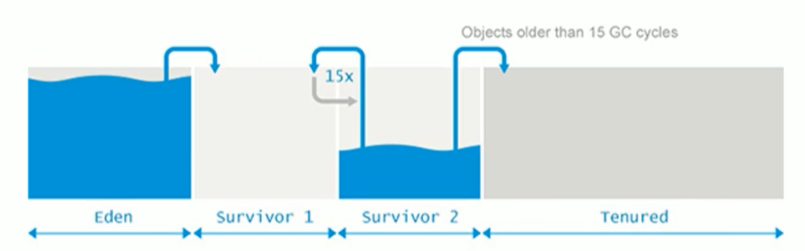
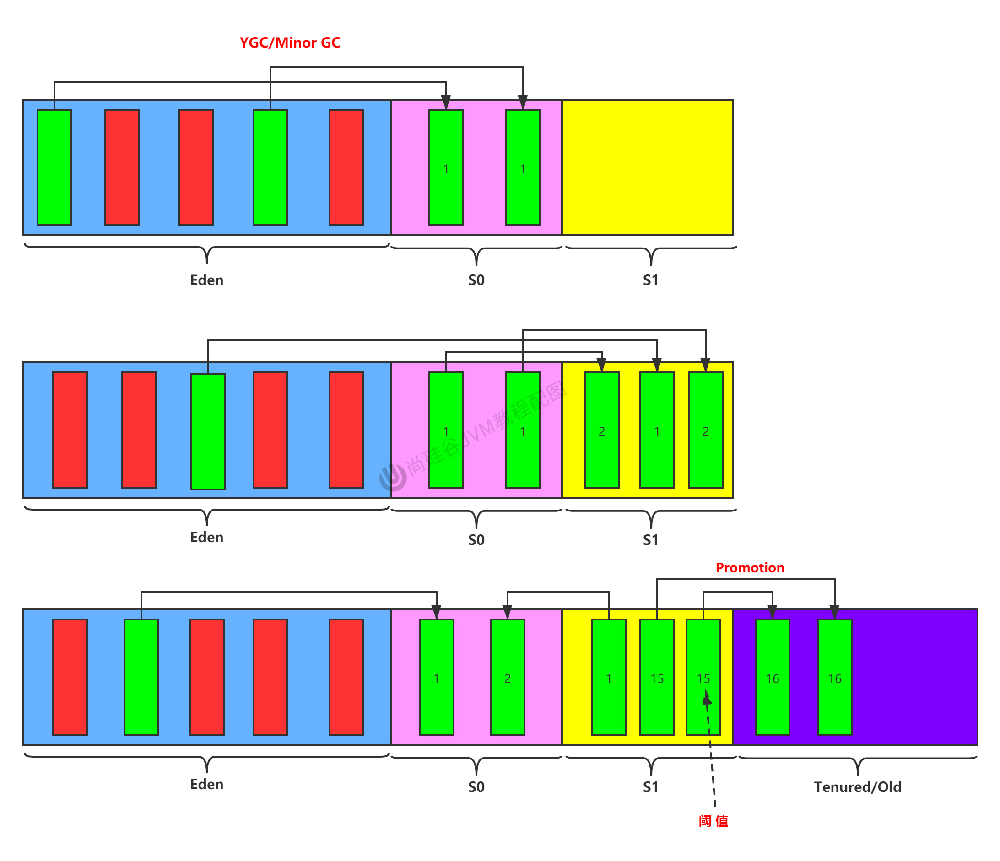
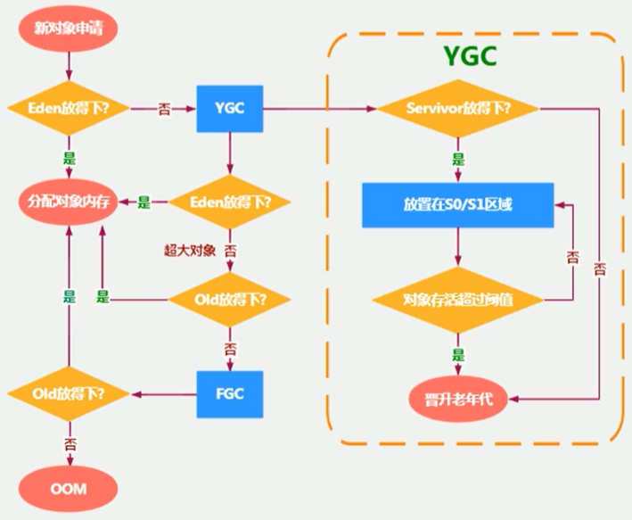
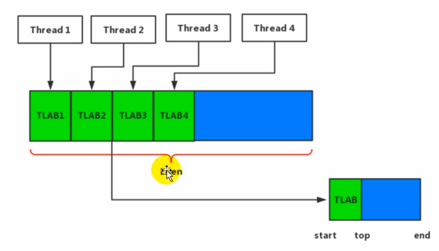

# 6.  堆

## 6.1. 堆（Heap）的核心概述

堆针对一个JVM进程来说是唯一的，也就是一个进程只有一个JVM，但是进程包含多个线程，他们是共享同一堆空间的。


一个JVM实例只存在一个堆内存，堆也是Java内存管理的核心区域。

Java堆区在JVM启动的时候即被创建，其空间大小也就确定了。是JVM管理的最大一块内存空间。

- 堆内存的大小是可以调节的。

《Java虚拟机规范》规定，堆可以处于物理上不连续的内存空间中，但在逻辑上它应该被视为连续的。

所有的线程共享Java堆，在这里还可以划分线程私有的缓冲区（Thread Local Allocation Buffer，TLAB）。

《Java虚拟机规范》中对Java堆的描述是：所有的对象实例以及数组都应当在运行时分配在堆上。（`The heap is the run-time data area from which memory for all class instances and arrays is allocated`）

数组和对象可能永远不会存储在栈上，因为栈帧中保存引用，这个引用指向对象或者数组在堆中的位置。

在方法结束后，堆中的对象不会马上被移除，仅仅在垃圾收集的时候才会被移除。

堆，是GC（Garbage Collection，垃圾收集器）执行垃圾回收的重点区域。


### 6.1.1. 堆内存细分

Java 7及之前堆内存逻辑上分为三部分：新生区+养老区+<font style="background:yellow">永久区</font>

- Young Generation Space 新生区 Young/New 又被划分为Eden区和Survivor区

- Tenure generation space 养老区 Old/Tenure

- Permanent Space 永久区 Perm

Java 8及之后堆内存逻辑上分为三部分：新生区+养老区+<font style="background:yellow">元空间</font>

- Young Generation Space 新生区 Young/New 又被划分为Eden区和Survivor区

- Tenure generation space 养老区 Old/Tenure

- Meta Space 元空间 Meta

约定：新生区（代）<=>年轻代 、 养老区<=>老年区（代）、 永久区<=>永久代

### 6.1.2. 堆空间内部结构（JDK7）


### 6.1.3. 堆空间内部结构（JDK8）


## 6.2. 设置堆内存大小与OOM

### 6.2.1. 堆空间大小的设置

Java堆区用于存储Java对象实例，那么堆的大小在JVM启动时就已经设定好了，大家可以通过选项"-Xmx"和"-Xms"来进行设置。

- "-Xms"用于表示堆区的起始内存，等价于`-XX:InitialHeapSize`

- "-Xmx"则用于表示堆区的最大内存，等价于`-XX:MaxHeapSize`

一旦堆区中的内存大小超过“-Xmx"所指定的最大内存时，将会抛出OutOfMemoryError异常。

开发通常会将-Xms和-Xmx两个参数配置相同的值，其目的是<font style="background:yellow">为了能够在Java垃圾回收机制清理完堆区后不需要重新分隔计算堆区的大小，从而提高性能。</font>

默认情况下

- 初始内存大小：物理电脑内存大小 / 64

- 最大内存大小：物理电脑内存大小 / 4

### 6.2.2. OutOfMemory举例

```java
public class OOMTest {
    public static void main(String[]args){
        ArrayList<Picture> list = new ArrayList<>();
        while(true){
            try {
                Thread.sleep(20);
            } catch (InterruptedException e){
                e.printStackTrace();
            }
            list.add(new Picture(new Random().nextInt(1024*1024)));
        }
    }
}
```

```java
Exception in thread "main" java.lang.OutofMemoryError: Java heap space
    at com.atguigu. java.Picture.<init>(OOMTest. java:25)
    at com.atguigu.java.O0MTest.main(OOMTest.java:16)
```

## 6.3. 年轻代与老年代

存储在JVM中的Java对象可以被划分为两类：

- 一类是生命周期较短的瞬时对象，这类对象的创建和消亡都非常迅速

- 另外一类对象的生命周期却非常长，在某些极端的情况下还能够与JVM的生命周期保持一致

Java堆区进一步细分的话，可以划分为年轻代（YoungGen）和老年代（oldGen）

其中年轻代又可以划分为Eden空间、Survivor0空间和Survivor1空间（有时也叫做from区、to区）


下面这参数开发中一般不会调：


配置新生代与老年代在堆结构的占比。

- 默认`-XX:NewRatio=2`，表示新生代占1，老年代占2，新生代占整个堆的1/3

- 可以修改`-XX:NewRatio=4`，表示新生代占1，老年代占4，新生代占整个堆的1/5

在HotSpot中，Eden空间和另外两个survivor空间缺省所占的比例是8：1：1

当然开发人员可以通过选项“`-xx:SurvivorRatio`”调整这个空间比例。比如`-xx:SurvivorRatio=8`

<font style="background:yellow">几乎所有的Java对象都是在Eden区被new出来的。</font>绝大部分的Java对象的销毁都在新生代进行了。

可以使用选项"`-Xmn`"设置新生代最大内存大小，这个参数一般使用默认值就可以了。



## 6.4. 图解对象分配过程

为新对象分配内存是一件非常严谨和复杂的任务，JVM的设计者们不仅需要考虑内存如何分配、在哪里分配等问题，并且由于内存分配算法与内存回收算法密切相关，所以还需要考虑GC执行完内存回收后是否会在内存空间中产生内存碎片。

1. new的对象先放伊甸园区。此区有大小限制。 
2. 当伊甸园的空间填满时，程序又需要创建对象，JVM的垃圾回收器将对伊甸园区进行垃圾回收（MinorGC），将伊甸园区中的不再被其他对象所引用的对象进行销毁。再加载新的对象放到伊甸园区。
3.  然后将伊甸园中的剩余对象移动到幸存者0区。 
4. 如果再次触发垃圾回收，此时上次幸存下来的放到幸存者0区的，如果没有回收，就会放到幸存者1区。 
5. 如果再次经历垃圾回收，此时会重新放回幸存者0区，接着再去幸存者1区。 
6. 啥时候能去养老区呢？可以设置次数。默认是15次。 
   - <font style="background:yellow">可以设置参数：进行设置</font>`-Xx:MaxTenuringThreshold= N`
7. 在养老区，相对悠闲。当养老区内存不足时，再次触发GC：Major GC，进行养老区的内存清理。
8. 若养老区执行了Major GC之后，发现依然无法进行对象的保存，就会产生OOM异常。  

```java
java.lang.OutofMemoryError: Java heap space
```



**流程图**



**总结**

- <font style="background:yellow">针对幸存者s0，s1区的总结：复制之后有交换，谁空谁是to</font>

- <font style="background:yellow">关于垃圾回收：频繁在新生区收集，很少在老年代收集，几乎不在永久代和元空间进行收集</font>

**常用调优工具（在JVM下篇：性能监控与调优篇会详细介绍）**

- JDK命令行

- Eclipse:Memory Analyzer Tool

- Jconsole

- VisualVM

- Jprofiler

- Java Flight Recorder

- GCViewer

- GC Easy

## 6.5. Minor GC，MajorGC、Full GC

JVM在进行GC时，并非每次都对上面三个内存区域一起回收的，大部分时候回收的都是指新生代。

针对Hotspot VM的实现，它里面的GC按照回收区域又分为两大种类型：一种是部分收集（Partial GC），一种是整堆收集（FullGC）

- 部分收集：不是完整收集整个Java堆的垃圾收集。其中又分为： 

- - 新生代收集（Minor GC / Young GC）：只是新生代的垃圾收集

- - 老年代收集（Major GC / Old GC）：只是老年代的圾收集。 

- - - 目前，只有CMS GC会有单独收集老年代的行为。

- - - <font style="background:yellow">注意，很多时候Major GC会和Full GC混淆使用，需要具体分辨是老年代回收还是整堆回收。</font>

- - 混合收集（MixedGC）：收集整个新生代以及部分老年代的垃圾收集。 

- - - 目前，只有G1 GC会有这种行为

- 整堆收集（Full GC）：收集整个java堆和方法区的垃圾收集。

### 6.5.1. 最简单的分代式GC策略的触发条件

#### 年轻代GC（Minor GC）触发机制

- 当年轻代空间不足时，就会触发MinorGC，这里的年轻代满指的是Eden代满，Survivor满不会引发GC。（每次Minor GC会清理年轻代的内存。） 

-  因为<font style="background:yellow">Java对象大多都具备朝生夕灭的特性</font>，所以Minor GC非常频繁，一般回收速度也比较快。这一定义既清晰又易于理解。 

-  Minor GC会引发STW，暂停其它用户的线程，等垃圾回收结束，用户线程才恢复运行 


#### 老年代GC（Major GC / Full GC）触发机制

- 指发生在老年代的GC，对象从老年代消失时，我们说 “Major GC” 或 “Full GC” 发生了 

-  出现了Major GC，经常会伴随至少一次的Minor GC（但非绝对的，在Paralle1 Scavenge收集器的收集策略里就有直接进行MajorGC的策略选择过程） 

- - 也就是在老年代空间不足时，会先尝试触发Minor GC。如果之后空间还不足，则触发Major GC

-  Major GC的速度一般会比Minor GC慢10倍以上，STW的时间更长 

-  如果Major GC后，内存还不足，就报OOM了 

#### Full GC触发机制（后面细讲）：

触发Full GC执行的情况有如下五种：

1. 调用System.gc()时，系统建议执行Full GC，但是不必然执行
2. 老年代空间不足
3. 方法区空间不足
4. 通过Minor GC后进入老年代的平均大小大于老年代的可用内存
5. 由Eden区、survivor space0（From Space）区向survivor space1（To Space）区复制时，对象大小大于To Space可用内存，则把该对象转存到老年代，且老年代的可用内存小于该对象大小

<font style="background:yellow">说明：Full GC 是开发或调优中尽量要避免的。这样暂时时间会短一些。</font>

## 6.6. 堆空间分代思想

为什么要把Java堆分代？不分代就不能正常工作了吗？

经研究，不同对象的生命周期不同。70%-99%的对象是临时对象。

- 新生代：有Eden、两块大小相同的survivor（又称为from/to，s0/s1）构成，to总为空。

- 老年代：存放新生代中经历多次GC仍然存活的对象。


其实不分代完全可以，<font style="background:yellow">分代的唯一理由就是优化GC性能</font>。如果没有分代，那所有的对象都在一块，就如同把一个学校的人都关在一个教室。GC的时候要找到哪些对象没用，这样就会对堆的所有区域进行扫描。而很多对象都是朝生夕死的，如果分代的话，把新创建的对象放到某一地方，当GC的时候先把这块存储“朝生夕死”对象的区域进行回收，这样就会腾出很大的空间出来。


## 6.7. 内存分配策略

如果对象在Eden出生并经过第一次Minor GC后仍然存活，并且能被Survivor容纳的话，将被移动到survivor空间中，并将对象年龄设为1。对象在survivor区中每熬过一次MinorGC，年龄就增加1岁，当它的年龄增加到一定程度（默认为15岁，其实每个JVM、每个GC都有所不同）时，就会被晋升到老年代。

对象晋升老年代的年龄阀值，可以通过选项`-XX:MaxTenuringThreshold`来设置

针对不同年龄段的对象分配原则如下所示：

- 优先分配到Eden

- 大对象直接分配到老年代（尽量避免程序中出现过多的大对象）

- 长期存活的对象分配到老年代

- 动态对象年龄判断：如果survivor区中相同年龄的所有对象大小的总和大于Survivor空间的一半，年龄大于或等于该年龄的对象可以直接进入老年代，无须等到`MaxTenuringThreshold`中要求的年龄。

- 空间分配担保： `-XX:HandlePromotionFailure`

## 6.8. 为对象分配内存：TLAB

### 6.8.1. 为什么有TLAB（Thread Local Allocation Buffer）？

-  堆区是线程共享区域，任何线程都可以访问到堆区中的共享数据 

-  由于对象实例的创建在JVM中非常频繁，因此在并发环境下从堆区中划分内存空间是线程不安全的 

-  为避免多个线程操作同一地址，需要使用加锁等机制，进而影响分配速度。 

### 6.8.2. 什么是TLAB？

- 从内存模型而不是垃圾收集的角度，对Eden区域继续进行划分，JVM为<font style="background:yellow">每个线程分配了一个私有缓存区域</font>，它包含在Eden空间内。 
- 多线程同时分配内存时，使用TLAB可以避免一系列的非线程安全问题，同时还能够提升内存分配的吞吐量，因此我们可以将这种内存分配方式称之为<font style="background:yellow">快速分配策略</font>。 

- 据我所知所有OpenJDK衍生出来的JVM都提供了TLAB的设计。 



### 6.8.3. TLAB的再说明

-  尽管不是所有的对象实例都能够在TLAB中成功分配内存，但<font style="background:yellow">JVM确实是将TLAB作为内存分配的首选。</font> 
- 在程序中，开发人员可以通过选项“`-XX:UseTLAB`”设置是否开启TLAB空间。 
- 默认情况下，TLAB空间的内存非常小，<font style="background:yellow">仅占有整个Eden空间的1%</font>，当然我们可以通过选项 “`-XX:TLABWasteTargetPercent`” 设置TLAB空间所占用Eden空间的百分比大小。 
- 一旦对象在TLAB空间分配内存失败时，JVM就会尝试着通过使用加锁机制确保数据操作的原子性，从而直接在Eden空间中分配内存。 


## 6.9. 小结：堆空间的参数设置

官网地址：https://docs.oracle.com/javase/8/docs/technotes/tools/windows/java.html

```java
// 详细的参数内容会在JVM下篇：性能监控与调优篇中进行详细介绍，这里先熟悉下
-XX:+PrintFlagsInitial  //查看所有的参数的默认初始值
-XX:+PrintFlagsFinal  //查看所有的参数的最终值（可能会存在修改，不再是初始值）
-Xms  //初始堆空间内存（默认为物理内存的1/64）
-Xmx  //最大堆空间内存（默认为物理内存的1/4）
-Xmn  //设置新生代的大小。（初始值及最大值）
-XX:NewRatio  //配置新生代与老年代在堆结构的占比
-XX:SurvivorRatio  //设置新生代中Eden和S0/S1空间的比例
-XX:MaxTenuringThreshold  //设置新生代垃圾的最大年龄
-XX:+PrintGCDetails //输出详细的GC处理日志
//打印gc简要信息：①-Xx：+PrintGC ② - verbose:gc
-XX:HandlePromotionFalilure：//是否设置空间分配担保
```

在发生Minor GC之前，虚拟机会<font style="background:yellow">检查老年代最大可用的连续空间是否大于新生代所有对象的总空间。</font>

- 如果大于，则此次Minor GC是安全的

- 如果小于，则虚拟机会查看`-XX:HandlePromotionFailure`设置值是否允担保失败。 

- - 如果`HandlePromotionFailure=true`，那么会继续检查老年代最大可用连续空间是否大于历次晋升到老年代的对象的平均大小。 

- - - 如果大于，则尝试进行一次Minor GC，但这次Minor GC依然是有风险的；

- - - 如果小于，则改为进行一次Full GC。

- - 如果`HandlePromotionFailure=false`，则改为进行一次Full Gc。

在JDK6 Update24之后，HandlePromotionFailure参数不会再影响到虚拟机的空间分配担保策略，观察openJDK中的源码变化，虽然源码中还定义了HandlePromotionFailure参数，但是在代码中已经不会再使用它。JDK6 Update 24之后的规则变为<font style="background:yellow">只要老年代的连续空间大于新生代对象总大小</font>或者<font style="background:yellow">历次晋升的平均大小就会进行Minor GC</font>，否则将进行FullGC。

## 6.X. 堆是分配对象的唯一选择么？

在《深入理解Java虚拟机》中关于Java堆内存有这样一段描述：

> 随着JIT编译期的发展与<font style="background:yellow">逃逸分析技术</font>逐渐成熟，<font style="background:yellow">栈上分配</font>、<font style="background:yellow">标量替换优化</font>技术将会导致一些微妙的变化，所有的对象都分配到堆上也渐渐变得不那么“绝对”了。

在Java虚拟机中，对象是在Java堆中分配内存的，这是一个普遍的常识。但是，有一种特殊情况，那就是<font style="background:yellow">如果经过逃逸分析（Escape Analysis）后发现，一个对象并没有逃逸出方法的话，那么就可能被优化成栈上分配</font>。这样就无需在堆上分配内存，也无须进行垃圾回收了。这也是最常见的堆外存储技术。

此外，前面提到的基于OpenJDK深度定制的TaoBaoVM，其中创新的GCIH（GC invisible heap）技术实现off-heap，将生命周期较长的Java对象从heap中移至heap外，并且GC不能管理GCIH内部的Java对象，以此达到降低GC的回收频率和提升GC的回收效率的目的。

### 6.X.1. 逃逸分析概述

如何将堆上的对象分配到栈，需要使用逃逸分析手段。

这是一种可以有效减少Java程序中同步负载和内存堆分配压力的跨函数全局数据流分析算法。

通过逃逸分析，Java Hotspot编译器能够分析出一个新的对象的引用的使用范围从而决定是否要将这个对象分配到堆上。

逃逸分析的基本行为就是分析对象动态作用域：

- 当一个对象在方法中被定义后，对象只在方法内部使用，则认为没有发生逃逸。

- 当一个对象在方法中被定义后，它被外部方法所引用，则认为发生逃逸。例如作为调用参数传递到其他地方中。

**举例1**

```java
public void my_method() {
    V v = new V();
    // use v
    // ....
    v = null;
}
```

没有发生逃逸的对象，则可以分配到栈上，随着方法执行的结束，栈空间就被移除，每个栈里面包含了很多栈帧

```java
public static StringBuffer createStringBuffer(String s1, String s2) {
    StringBuffer sb = new StringBuffer();
    sb.append(s1);
    sb.append(s2);
    return sb;
}
```

上述方法如果想要`StringBuffer sb`不发生逃逸，可以这样写

```java
public static String createStringBuffer(String s1, String s2) {
    StringBuffer sb = new StringBuffer();
    sb.append(s1);
    sb.append(s2);
    return sb.toString();
}
```

**举例2**

```java
public class EscapeAnalysis {

    public EscapeAnalysis obj;

    /**
     * 方法返回EscapeAnalysis对象，发生逃逸
     * @return
     */
    public EscapeAnalysis getInstance() {
        return obj == null ? new EscapeAnalysis() : obj;
    }

    /**
     * 为成员属性赋值，发生逃逸
     */
    public void setObj() {
        this.obj = new EscapeAnalysis();
    }

    /**
     * 对象的作用于仅在当前方法中有效，没有发生逃逸
     */
    public void useEscapeAnalysis() {
        EscapeAnalysis e = new EscapeAnalysis();
    }

    /**
     * 引用成员变量的值，发生逃逸
     */
    public void useEscapeAnalysis2() {
        EscapeAnalysis e = getInstance();
    }
}
```

**参数设置**

在JDK 6u23 版本之后，HotSpot中默认就已经开启了逃逸分析

如果使用的是较早的版本，开发人员则可以通过：

- 选项“`-XX:+DoEscapeAnalysis`"显式开启逃逸分析

- 通过选项“`-XX:+PrintEscapeAnalysis`"查看逃逸分析的筛选结果

**结论**：<font style="background:yellow">开发中能使用局部变量的，就不要使用在方法外定义。</font>

### 6.X.2. 逃逸分析：代码优化

使用逃逸分析，编译器可以对代码做如下优化：

一、<font style="background:yellow">栈上分配</font>：将堆分配转化为栈分配。如果一个对象在子程序中被分配，要使指向该对象的指针永远不会发生逃逸，对象可能是栈上分配的候选，而不是堆上分配

二、<font style="background:yellow">同步省略</font>：如果一个对象被发现只有一个线程被访问到，那么对于这个对象的操作可以不考虑同步。

三、<font style="background:yellow">分离对象或标量替换</font>：有的对象可能不需要作为一个连续的内存结构存在也可以被访问到，那么对象的部分（或全部）可以不存储在内存，而是存储在CPU寄存器中。


