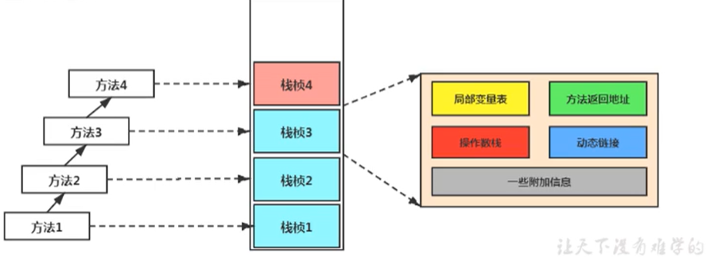

# 4. 虚拟机栈

## 4.1. 虚拟机栈概述

### 4.1.1. 虚拟机栈出现的背景

由于跨平台性的设计，Java的指令都是根据栈来设计的。不同平台CPU架构不同，所以不能设计为基于寄存器的。

<font style="background:yellow">优点是跨平台，指令集小，编译器容易实现，缺点是性能下降，实现同样的功能需要更多的指令</font>。

### 4.1.2. 初步印象

有不少Java开发人员一提到Java内存结构，就会非常粗粒度地将JVM中的内存区理解为仅有Java堆（heap）和Java栈（stack）？为什么？

### 4.1.3. 内存中的栈与堆

栈是运行时的单位，而堆是存储的单位

- 栈解决程序的运行问题，即程序如何执行，或者说如何处理数据。

- 堆解决的是数据存储的问题，即数据怎么放，放哪里


### 4.1.4. 虚拟机栈基本内容

#### Java虚拟机栈是什么？


Java虚拟机栈（Java Virtual Machine Stack），早期也叫Java栈。每个线程在创建时都会创建一个虚拟机栈，其内部保存一个个的栈帧（Stack Frame），对应着一次次的Java方法调用，是线程私有的。


#### 生命周期


生命周期和线程一致


#### 作用


主管Java程序的运行，它保存方法的局部变量、部分结果，并参与方法的调用和返回。


#### 栈的特点

栈是一种快速有效的分配存储方式，访问速度仅次于罹序计数器。

JVM直接对Java栈的操作只有两个：

- 每个方法执行，伴随着进栈（入栈、压栈）

- 执行结束后的出栈工作

对于栈来说不存在垃圾回收问题（栈存在溢出的情况）


#### 面试题：开发中遇到哪些异常？

**栈中可能出现的异常**

Java 虚拟机规范允许<font style="background:yellow">Java栈的大小是动态的或者是固定不变的</font>。

● 如果采用固定大小的Java虚拟机栈，那每一个线程的Java虚拟机栈容量可以在线程创建的时候独立选定。如果线程请求分配的栈容量超过Java虚拟机栈允许的最大容量，Java虚拟机将会抛出一个<font style="background:yellow">StackOverflowError</font> 异常。 
● 如果Java虚拟机栈可以动态扩展，并且在尝试扩展的时候无法申请到足够的内存，或者在创建新的线程时没有足够的内存去创建对应的虚拟机栈，那Java虚拟机将会抛出一个<font style="background:yellow"> OutOfMemoryError</font> 异常。 

```java
public static void main(String[] args) {
    test();
}
public static void test() {
    test();
}
//抛出异常：Exception in thread"main"java.lang.StackoverflowError
//程序不断的进行递归调用，而且没有退出条件，就会导致不断地进行压栈。
```

**设置栈内存大小**

我们可以使用参数 -Xss选项来设置线程的最大栈空间，栈的大小直接决定了函数调用的最大可达深度

```java
public class StackDeepTest{ 
    private static int count=0; 
    public static void recursion(){
        count++; 
        recursion(); 
    }
    public static void main(String args[]){
        try{
            recursion();
        } catch (Throwable e){
            System.out.println("deep of calling="+count); 
            e.printstackTrace();
        }
    }
}
```

## 4.2. 栈的存储单位

### 4.2.1. 栈中存储什么？

每个线程都有自己的栈，栈中的数据都是以<font style="background:yellow">栈帧（Stack Frame）的格式存在</font>。

在这个线程上正在执行的每个方法都各自对应一个栈帧（Stack Frame）。

栈帧是一个内存区块，是一个数据集，维系着方法执行过程中的各种数据信息。

### 4.2.2. 栈运行原理

JVM直接对Java栈的操作只有两个，就是对<font style="background:yellow">栈帧的压栈和出栈，遵循“先进后出”/“后进先出”原则</font>。

在一条活动线程中，一个时间点上，只会有一个活动的栈帧。即只有当前正在执行的方法的栈帧（栈顶栈帧）是有效的，这个栈帧被称为<font style="background:yellow">当前栈帧（Current Frame）</font>，与当前栈帧相对应的方法就是<font style="background:yellow">当前方法（Current Method）</font>，定义这个方法的类就是<font style="background:yellow">当前类（Current Class）</font>。

执行引擎运行的所有字节码指令只针对当前栈帧进行操作。

如果在该方法中调用了其他方法，对应的新的栈帧会被创建出来，放在栈的顶端，成为新的当前帧。


不同线程中所包含的栈帧是不允许存在相互引用的，即不可能在一个栈帧之中引用另外一个线程的栈帧。

如果当前方法调用了其他方法，方法返回之际，当前栈帧会传回此方法的执行结果给前一个栈帧，接着，虚拟机会丢弃当前栈帧，使得前一个栈帧重新成为当前栈帧。

Java方法有两种返回函数的方式，<font style="background:yellow">一种是正常的函数返回，使用return指令；另外一种是抛出异常。不管使用哪种方式，都会导致栈帧被弹出</font>。

```java
public class CurrentFrameTest{
    public void methodA(){
        system.out.println（"当前栈帧对应的方法->methodA");
        methodB();
        system.out.println（"当前栈帧对应的方法->methodA");
    }
    public void methodB(){
        System.out.println（"当前栈帧对应的方法->methodB");
    }
```

### 4.2.3. 栈帧的内部结构

每个栈帧中存储着：

- <font style="background:yellow">局部变量表（Local Variables）</font>

- <font style="background:yellow">操作数栈（operand Stack）（或表达式栈）</font>

- 动态链接（DynamicLinking）（或指向运行时常量池的方法引用）

- 方法返回地址（Return Address）（或方法正常退出或者异常退出的定义）

- 一些附加信息



并行每个线程下的栈都是私有的，因此每个线程都有自己各自的栈，并且每个栈里面都有很多栈帧，栈帧的大小主要由局部变量表 和 操作数栈决定的


## 4.3. 局部变量表(Local Variables)

局部变量表也被称之为局部变量数组或本地变量表

-  <font style="background:yellow">定义为一个数字数组，主要用于存储方法参数和定义在方法体内的局部变量</font>，这些数据类型包括各类基本数据类型、对象引用（reference），以及returnAddress类型。 

-  由于局部变量表是建立在线程的栈上，是线程的私有数据，因此<font style="background:yellow">不存在数据安全问题</font> 

-  <font style="background:yellow">局部变量表所需的容量大小是在编译期确定下来的</font>，并保存在方法的Code属性的maximum local variables数据项中。在方法运行期间是不会改变局部变量表的大小的。 

-  <font style="background:yellow">方法嵌套调用的次数由栈的大小决定</font>。一般来说，栈越大，方法嵌套调用次数越多。对一个函数而言，它的参数和局部变量越多，使得局部变量表膨胀，它的栈帧就越大，以满足方法调用所需传递的信息增大的需求。进而函数调用就会占用更多的栈空间，导致其嵌套调用次数就会减少。 

- <font style="background:yellow">局部变量表中的变量只在当前方法调用中有效</font>。在方法执行时，虚拟机通过使用局部变量表完成参数值到参数变量列表的传递过程。当方法调用结束后，随着方法栈帧的销毁，局部变量表也会随之销毁。 

### 4.3.1. 关于Slot的理解

- 局部变量表，最基本的存储单元是Slot（变量槽） 

-  参数值的存放总是在局部变量数组的index0开始，到数组长度-1的索引结束。 

-  局部变量表中存放编译期可知的各种基本数据类型（8种），引用类型（reference），returnAddress类型的变量。 

-  在局部变量表里，32位以内的类型只占用一个slot（包括returnAddress类型），64位的类型（long和double）占用两个slot。 

-  byte、short、char 在存储前被转换为int，boolean也被转换为int，0表示false，非0表示true。 

-  JVM会为局部变量表中的每一个Slot都分配一个访问索引，通过这个索引即可成功访问到局部变量表中指定的局部变量值 

-  当一个实例方法被调用的时候，它的方法参数和方法体内部定义的局部变量将会<font style="background:yellow">按照顺序被复制</font>到局部变量表中的每一个slot上 

-  <font style="background:yellow">如果需要访问局部变量表中一个64bit的局部变量值时，只需要使用前一个索引即可</font>。（比如：访问long或double类型变量） 

-  如果当前帧是由构造方法或者实例方法创建的，那么<font style="background:yellow">该对象引用this将会存放在index为0的slot处</font>，其余的参数按照参数表顺序继续排列。 

### 4.3.2. Slot的重复利用

栈帧中的局部变量表中的槽位是可以重用的，如果一个局部变量过了其作用域，那么在其作用域之后申明的新的局部变就很有可能会复用过期局部变量的槽位，从而达到节省资源的目的。

```java
public class SlotTest {
    public void localVarl() {
        int a = 0;
        System.out.println(a);
        int b = 0;
    }
    public void localVar2() {
        {
            int a = 0;
            System.out.println(a);
        }
        //此时的就会复用a的槽位
        int b = 0;
    }
}
```

### 4.3.3. 静态变量与局部变量的对比

参数表分配完毕之后，再根据方法体内定义的变量的顺序和作用域分配。

我们知道类变量表有两次初始化的机会，第一次是在“<font style="background:yellow">准备阶段</font>”，执行系统初始化，对类变量设置零值，另一次则是在“<font style="background:yellow">初始化</font>”阶段，赋予程序员在代码中定义的初始值。

和类变量初始化不同的是，局部变量表不存在系统初始化的过程，这意味着<font style="background:yellow">一旦定义了局部变量则必须人为的初始化，否则无法使用</font>。

```java
public void test(){
    int i;
    System. out. println(i);//这样的代码是错误的，没有赋值不能够使用。
}
```

这样的代码是错误的，没有赋值不能够使用。

### 4.3.4. 补充说明

在栈帧中，与性能调优关系最为密切的部分就是前面提到的局部变量表。在方法执行时，虚拟机使用局部变量表完成方法的传递。

<font style="background:yellow">局部变量表中的变量也是重要的垃圾回收根节点，只要被局部变量表中直接或间接引用的对象都不会被回收</font>。