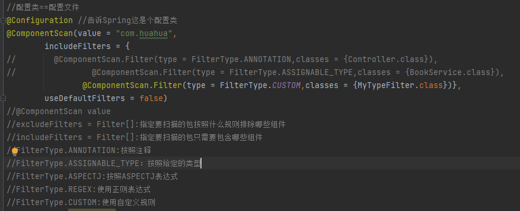

# Spring注解驱动

## 一、组件注册

### 1.@Configuration（配置类）

告诉Spring这是个配置类

### 2.@ComponentScan（注解扫描）




```
value：扫描的包路径
includeFilters：参数是一个Filter[]数组，指定扫描的包按照规则包含哪些组件
excludeFilters：参数是一个Filter[]数组，指定扫描的包按照规则排除哪些组件
FilterType.ANNOTATION:按照注释
FilterType.ASSIGNABLE_TYPE：按照给定的类型
FilterType.ASPECTJ:按照ASPECTJ表达式
FilterType.REGEX:使用正则表达式
FilterType.CUSTOM:使用自定义规则，需要实现TypeFilter接口
```

* FilterType.CUSTOM:使用自定义规则

* ```java
  public class MyTypeFilter implements TypeFilter {
      /**
       *
       * @param metadataReader 读取到当前扫描类的信息
       * @param metadataReaderFactory 可以获取到其他类信息
       * @return
       * @throws IOException
       */
      @Override
      public boolean match(MetadataReader metadataReader, MetadataReaderFactory metadataReaderFactory) throws IOException {
          //获取当前类注解信息
          AnnotationMetadata annotationMetadata = metadataReader.getAnnotationMetadata();
          //获取当前正在扫描的类信息
          ClassMetadata classMetadata = metadataReader.getClassMetadata();
          //获取当前类资源（类路径）
          Resource resource = metadataReader.getResource();
          String className = classMetadata.getClassName();
          System.out.println("---->"+className);
  
          if(className.contains("er")){
              return true;
          }
          return false;
      }
  }
  ```

### 3.@Scope（调整作用域）

```
prototype：多实例的：ioc容器启动并不会去调用方法创建对象在容器中
singleton:单实例的（默认值）：ioc容器启动会调用方法创建对象放在ioc容器中
以后每次获取就直接从容器（map.get()）中拿
request:同一个请求创建一个实例
session:同一个session创建一个实例
```

### 4.@Lazy（懒加载）

```
bean 懒加载：
      单实例bean：默认在容器启动的时候创建对象
      懒加载：容器启动不创建对象。第一次使用（获取）Bean创建对象，并进行一些初始化
```

### 5. @Conditional（按照一定的条件进行判断，满足条件给容器中注册bean）

需要实现Condition接口

```java
 /**
     * @Conditional({Condition}):按照一定的条件进行判断，满足条件给容器中注册bean
     *
     * 如果系统是windows：给容器注册（“bill”）
     * 如果系统是linux：给容器注册（“linux”）
     */
    @Conditional({LinuxCondition.class})
    @Bean("linux")
    public Person person02(){
        return new Person("Linus",48);
```

```java
/**
 * 判断是否Linux系统
 */
public class LinuxCondition implements Condition {
    @Override
    public boolean matches(ConditionContext conditionContext, AnnotatedTypeMetadata annotatedTypeMetadata) {
        Environment environment = conditionContext.getEnvironment();
        String property = environment.getProperty("os.name");
        if(property.contains("linux")){
            return true;
        }
        return false;
    }
}
```

### 6.给容器中注册组件

```java
1）、包扫描+组件标注主机（@Controller/@Service/@Repository/@Component）[局限：自己写的类可以下载，第三方jar包等非自己写的类无法加载]
2）、@Bean[导入的第三方包里面的组件]
3）、@Import[快速给容器中导入一个组件]
     1.@Import(要导入到容器中的组件)；容器中就会自动注册这个组件，id默认为全类名
     2.ImportSelector:返回需要导入的组件的全类名的数组,需要实现ImportSelector接口；
     3.ImportBeanDefinitionRegistrar:手动注册bean到容器中，实现ImportBeanDefinitionRegistrar接口
     例如：@Import({Color.class, Red.class, MyImportSelector.class, MyImportBeanDefinitionRegistrar.class})//导入组件，id默认是组件的全类名
```

```java
/**
 * 自定义逻辑返回需要导入的组件
 */
public class MyImportSelector implements ImportSelector {

    /**
     * 返回值就是要导入到容器中组件全类名
     * @param annotationMetadata 标注Import注解类的所有注解信息
     * @return
     */
    @Override
    public String[] selectImports(AnnotationMetadata annotationMetadata) {
        //annotationMetadata.get
        //方法不用返回null
        return new String[]{"com.huahua.bean.Blue","com.huahua.bean.Yellow"};
    }
}

```

```java
public class MyImportBeanDefinitionRegistrar implements ImportBeanDefinitionRegistrar {

    /**
     *
     * @param annotationMetadata 当前类的注解信息
     * @param beanDefinitionRegistry beanDefinition注册类（bean定义注册类）
     *                               把所有需要添加到容器中的bean：调用
     *                               BeanDefinitionRegistry.registerBeanDefinition手工注册
     */
    @Override
    public void registerBeanDefinitions(AnnotationMetadata annotationMetadata, BeanDefinitionRegistry beanDefinitionRegistry) {
        boolean red = beanDefinitionRegistry.containsBeanDefinition("com.huahua.bean.Red");
        boolean blue = beanDefinitionRegistry.containsBeanDefinition("com.huahua.bean.Blue");
        if (red && blue){
            //指定bean定义信息；（Bean类型，Bean...）
            RootBeanDefinition rootBeanDefinition = new RootBeanDefinition(RainBow.class);
            //注册一个Bean，指定bean名
            beanDefinitionRegistry.registerBeanDefinition("rainBow",rootBeanDefinition);
        }
    }
}
```


```          java
4）、使用Spring提供的FactoryBean（工厂Bean）
     1)、默认获取到的是工厂bean调用getObject创建的对象
     2）、要获取工厂Bean本身，我们需要给id前面加一个&
              例如：&ColorFactory```
```

```java
@Bean
public ColorFactoryBean colorFactoryBean(){
    return new ColorFactoryBean();
}
```

```java

//创建Spring定义的FactoryBean
public class ColorFactoryBean implements FactoryBean<Color> {

    //返回Color对象，这个对象添加到容器中
    @Override
    public Color getObject() throws Exception {
        System.out.println("ColorFactoryBean....");
        return new Color();
    }

    @Override
    public Class<?> getObjectType() {
        return Color.class;
    }

    /**
     * 是单例？
     * true：这个bean是单实例，在容器中保存一份
     * false:多实例，每次获取都会创建一个新的
     */
    @Override
    public boolean isSingleton() {
        return false;
    }
}
```

## 二、生命周期

```java
bean的生命周期
	bean创建---初始化---销毁的过程
容器管理bean的生命周期：
	我们可以自定义初始化和销毁方法：容器在bean进行到当前生命周期的时候来调用我们自定义的初始化和销毁方法
构造（对象创建）
	单实例：在容器启动的时候创建对象
    多实例：在每次获取的时候创建对象
BeanPostProcessor.postProcessBeforeInitialization
初始化：
	对象创建完成，并赋值好，调用初始化方法...
BeanPostProcessor.postProcessAfterInitialization
遍历得到容器中所有的BeanPostProcessors：挨个执行beforeInitialization,一但返回null，跳出for循环，不会执行后面的BeanPostProcessor.postProcessBeforeInitialization(result, beanName);
this.populateBean(beanName, mbd, instanceWrapper);给bean进行属性赋值
this.initializeBean{
 	this.applyBeanPostProcessorsBeforeInitialization(bean, beanName);
 	this.invokeInitMethods(beanName, wrappedBean, mbd);执行初始化
 	this.applyBeanPostProcessorsAfterInitialization(wrappedBean, beanName);
 }
 销毁：
      单实例：容器关闭的时候关闭
      多实例：容器不会管理这个bean；容器不会调用销毁方法
 1）、指定初始化和销毁方法
      指定init-method="" destroy-method=""
 2)、通过让Bean实现InitializingBean（定义初始化逻辑）、DisposableBean（定义销毁逻辑）
 3)、可以使用JSR250：
 @PostConstruct:在bean创建完成时完成并且属性赋值完成；来执行初始化方法
 @PreDestroy：在容器销毁bean之前通知我们进行清理工作
 4）、BeanPostProcessor【interface】：bean的后置处理器
      在bean初始化前后进行一些处理工作：
      postProcessBeforeInitialization：在初始化之前工作
      postProcessAfterInitialization：在初始化之后工作

  Spring底层对BeanPostProcessor的使用:
      bean赋值，注入其他组件，@Autowired，生命周期注解功能，@Async，xxx BeanPoseProcessor;
 
```

## 三、AOP

### 1.AOP简介

AOP：【动态代理】

​	指在程序运行期间动态的将某段代码切入到指定方法指定位置进行运行的编程方式。

①、导入aop模块；Spring AOP; （spring-aspects）

②、定义一个业务逻辑类 (MathCalculator)；在业务逻辑运行的时候将日志进行打印（方法之前、方法运行结束、方法出现异常、xxx）

```java
public class MathCalculator {

    public int div(int i,int j){
        return i/j;
    }

}
```

③、定义一个日志切面类（LogAspects）：切面类里面的方法需要动态感知MathCalculator.div运行到哪里然后执行。

* 通知方法：
  * 前置通知（@Before）：logStart：在目标方法（div）运行之前运行
  * 后置通知（@After）：logEnd：在目标方法（div）运行结束之后运行
  * 返回通知（@AfterReturning）：logReturn：在目标方法（div）正常返回之后运行
  * 异常通知（@AfterThrowing）：logException：在目标方法（div）出现异常以后运行
  * 环绕通知（@Around）：动态代理：手动推进目标方法运行（joinPoint.procced()）

```java
@Aspect
public class LogAspects {

    public void logStart(){
        System.out.println("除法运行。。。。参数列表是：{}");
    }

    public void logEnd(){
        System.out.println("除法结束。。。。");
    }

    public void logReturn(){
        System.out.println("除法正常返回。。。。运行结果：{}");
    }

    public void logException(){
        System.out.println("除法异常。。。。异常信息：{}");
    }

}
```

④、给切面类的目标方法标注方法何时何地运行（通知注解）

⑤、将切面类和业务逻辑类（目标方法所在类）都放入到容器中

⑥、必须告诉Spring哪个类是切面类（给切面类上加一个注解：@Aspect）

​	@Aspect：告诉Spring当前类是一个切面类

⑦、给配置类中加@EnableAspectJAutoProxy【开启基于注解的aop模式】

​	在Spring中很多的@Enablexxx;


**三步：**

​	**1）、将业务逻辑组件和切面类都加入到容器中；告诉Spring哪个是切面类（@Aspect）**

​	**2）、在切面类上的每一个通知方法上标注通知注解，告诉Spring何时何地运行（切入点表达式）**

​	**3）、开启基于注解的aop模式@EnableAspectJAutoProxy**

2.

### 2.AOP原理【看给容器中注册了什么组件，这个组件什么时候工作，这个组件的功能是什么？】

**@EnableAspectJAutoProxy**

* @Import({AspectJAutoProxyRegistrar.class})

  * 利用AspectJAutoProxyRegistrar自定义给容器中注册bean:

    internalAutoProxyCreator=AnnotationAwareAspectJAutoProxyCreator

    给容器中注册一个AnnotationAwareAspectJAutoProxyCreator;


* AnnotationAwareAspectJAutoProxyCreator


