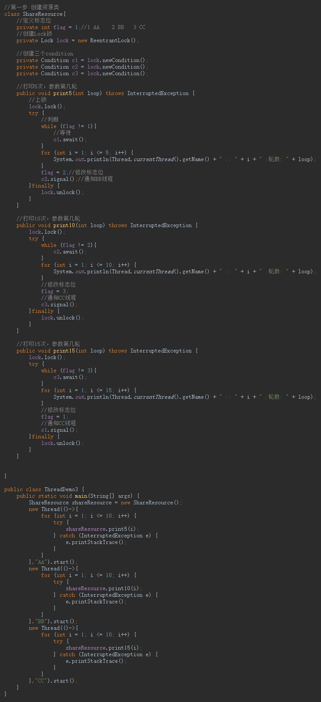
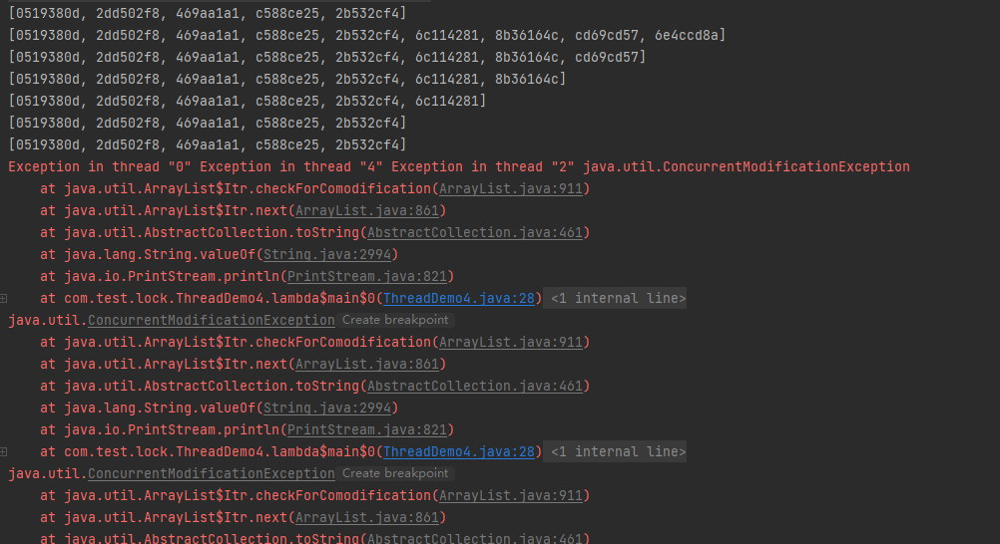

# 并发编程

## 一、什么是juc

### 1.1 juc简介

在 Java 中，线程部分是一个重点，本篇文章说的 JUC 也是关于线程的。JUC 就是 java.util .concurrent 工具包的简称。这是一个处理线程的工具包，JDK  1.5 开始出现的。

### 1.2 进程与线程

进程：指在系统中正在运行的一个应用程序；程序一旦运行就是进程；进程— —资源分配的最小单位。 

线程：系统分配处理器时间资源的基本单元，或者说进程之内独立执行的一个 单元执行流。线程——程序执行的最小单位。

### 1.3 线程的状态

#### 1.3.1 线程状态枚举类


#### 1.3.2  wait/sleep的区别

1. sleep是Thread类的静态方法；wait是Object的方法，任何实例对象都能调用。
2. sleep不会释放锁，它也不需要占用锁。wait会释放锁，但调用它的前提是当前线程占有锁(即代码要做synchronized中)。
3. 它们都可以被interrupted方法中断。

### 1.4 并发与并行

**并发**：同一时刻多个线程再访问同一资源，多个线程对一个点。

例子：春运抢票 电商秒杀.....

**并行**：多项工作一起执行，之后再汇总

例子：泡方便面------电水壶烧水，一边撕调料包倒入桶中

### 1.5 [管程 （monitor又称监视器）](/Java学习/juc并发编程/拓展/管程.md)

**管程**是保证了同一时刻只有一个进程在管程内活动，即管程内定义的操作在同一时刻只能被一个进程调用(由编译器实现)。


JVM同步是基于进入和退出**管程**对象实现的，每个对象都会有一个**管程**对象，**管程**会随着java对象一同创建和销毁。


执行线程首先要持有管程对象，然后才能执行方法，当方法完成之后会释放管程，方法在执行的时候会持有管程，其他线程无法再获取同一个管程。

### 1.6 用户线程和守护线程

**用户线程**：平时用到的普通线程，自定义线程

**守护线程**：运行再后台，是一种特殊的线程

**如果主线程结束，用户线程还在运行，JVM存活**

**如果没有用户现场，都是守护线程，JVM结束**

## 二、 Lock接口

### 2.1 Synchronized

#### 2.1.1 Synchronized关键字回顾

synchronized是Java中的关键字，是一种同步锁。它的修饰对象有以下几种：

1. 修饰一个代码块，被修饰的代码块被称为同步语句块，其作用的范围是大括号{ }括起来的代码，作用的对象是调用这个代码块的对象；
2. 修饰一个方法，被修饰的方法被称为同步方法，其作用范围是整个方法，作用的对象是调用这个方法的对象；
   * 虽然可以使用 synchronized 来定义方法，但 synchronized 并不属于方法定 义的一部分，因此，synchronized 关键字不能被继承。如果在父类中的某个方 法使用了 synchronized 关键字，而在子类中覆盖了这个方法，在子类中的这 个方法默认情况下并不是同步的，而必须显式地在子类的这个方法中加上 synchronized 关键字才可以。当然，还可以在子类方法中调用父类中相应的方 法，这样虽然子类中的方法不是同步的，但子类调用了父类的同步方法，因此， 子类的方法也就相当于同步了。
3. 修改一个静态的方法，其作用的范围是整个静态方法，作用的对象是这个类的所有对象；
4. 修改一个类，其作用的范围是synchronized后面括号括起来的部分；

如果一个代码块被synchronized修饰了，当一个线程获取了对应的锁，并执行该代码块时，其他线程便只能一直等待，等待获取锁的线程释放锁，而这里获取锁的线程释放锁只有两种情况：

1. 获取锁的线程执行完了代码块，然后线程释放对锁的占有；
2. 线程执行时发生异常，此时JVM会让线程自动释放锁

* 那么如果这个获取锁的线程由于要等待IO或者其他原因（比如调用sleep方法）被阻塞了，但是又没有释放锁，其他线程只能干巴巴的等待，试想一下，多么影响程序的执行效率。

  因此就需要有一种机制可以不让等待的线程一直无限期的等待下去（比如只等待一定的时间或者能够响应中断），通过Lock就可以办到。

### 2.2 什么是Lock

Lock锁实现提供了使用同步方法的语句可以获取的更广泛的锁操作。它们允许更灵活的结构，可能具有不同的属性，并且可能支持多个关联的条件的对象。Lock提供了比synchronized的更多的功能。

**Lock与Synchronized区别**

* Lock不是Java语言内置的，synchronized是Java语言的关键字，因此是内置特性。Lock是一个类，通过这个类可以实现同步访问；
* Lock和synchronized有一点非常大的不同，采用synchronized不需要用户去手动释放锁，当synchronized方法或者synchronized代码块执行完之后，系统会自动让线程释放对锁的占用；而Lock则必须要用户去手动释放锁，如果没有主动释放锁，就有可能导致出现死锁现象。


#### 2.2.1 Lock接口


下面来逐个讲述Lock接口中的每个方法的使用

#### 2.2.2 lock

lock()方法是平常使用最多的一个方法，用来获取锁。如果锁已被其他线程获取，则进行等待。

采用Lock，不许主动去释放锁，并且在发生异常时，不会自动释放锁。因此一般来说，使用try{ }catch{ }块中进行，并且将释放锁的操作放在finally{ }块中进行，以保证锁一定被释放，防止死锁的发生。通常使用Lock来进行同步的话，是以下面这种形式去使用的：

```java
Lock lock = ...;
lock.lock();
try{
//处理任务
}catch(Exception ex){
}finally{
    lock.unlock(); //释放锁
}
```

#### 2.2.3 newCondition

关键字synchronized与wait()/notify这两个方法一起使用可以实现等待/通知模式，Lock锁的newCondition()方法返回Condition对象，Condition类也可以实现等待/通知模式。

用notify()通知时，JVM会随机唤醒某个等待的线程，使用Condition类可以进行选择性通知，Condition比较常用的两个方法：

* await()会使当前线程等待，同时会释放锁，当其他线程调用signal()时，线程会重新获得锁并继续执行。
* signal()用于唤醒一个等待的线程。

**注意**：在调用Condition的await()/signal方法前，也需要线程持有相关的Lock锁，调用await()后线程会释放这个锁，在singal()调用后会从当前Condition对象的等待队列中，唤醒一个线程，唤醒的线程尝试获得锁，一旦获得锁成功就继续执行

### 2.3 ReentrantLock

ReentrantLock，意思是“可重入锁”，关于可重入锁的概念将在后面讲述。

ReentrantLock是唯一实现了Lock接口的类，并且ReentrantLock提供了更多的方法。下面通过一些实例具体看一下如何使用。


### 2.4 ReadWriteLock

ReadWriteLock也是一个接口，在它里面只定义了两个方法：


一个用来获取读锁，一个用来获取写锁。也就是说将文件的读写操作分开，分成2个锁来分配给线程，从而使得多个线程可以同时进行读操作，下面的**ReentrantReadWriteLock**实现了 ReadWriteLock 接口。

ReentrantReadWriteLock里面提供了很多丰富的方法，不过最主要的有两个方法：readLock()和writeLock()用来获取读锁和写锁。

下面通过例子来看一下 ReentrantReadWriteLock 具体用法。


运行结果：


说明 1-5 线程在同时进行读操作。这样就大大提升了读操作的效率。

**注意**

* 如果有一个线程已经占用了读锁，则此时其他线程如果要申请写锁，则申请写锁的线程会一直等待释放读锁。
* 如果有一个线程已经占用了写锁，则此时其他线程如果申请写锁或者读锁，则申请的线程会一直等待释放写锁。

### 2.5 小结(重点)

Lock和synchronized有以下几点不同：

1. Lock是一个接口，而synchronized是Java中的关键字，synchronized是内置的语言实现；
2. synchronized发生异常时，会自动释放线程占有的锁，因此不会导致死锁现象发生；而Lock在发生异常时，如果没有主动通过unLock()去释放锁，则很可能造成死锁现象，因此使用Lock时需要在finally块中释放锁；
3. Lock可以让等待锁的线程响应中断，而synchronized却不行，使用synchronized时，等待的线程会一直等待下去，不能够响应中断。
4. 通过Lock可以知道有没有成功获取锁，而synchronized却无法办到。
5. Lock可以提高多个线程进行读操作的效率。

在性能上来说，如果竞争资源不激烈，两者的性能是差不多的，而当竞争资源非常激烈时（即有大量线程同时竞争），此时Lock的性能要远优于synchronized。

## 三、线程间通信

线程间通信的模型有两种：共享内存和消息传递，一下方法都是基于这两种模型来实现的。我们基于一道面试常见的题目来分析

**场景----两个线程对当前数值加1，另一个线程对当前数值减1，要求用线程间通信**

### 3.1 synchronized方案


### 3.2 Lock 方案


### 3.3 线程间定制化通信

#### 3.3.1 案例介绍

==问题: A 线程打印 5 次 A，B 线程打印 10 次 B，C 线程打印 15 次 C,按照 此顺序循环 10 轮==

#### 3.3.2 实现流程



synchronized实现同步的基础：Java中的每一个对象都可以作为锁，具体表现为以下3种形式。

* 对于普通同步方法，锁对象是当前实例对象。
* 对应静态同步方法，锁对象是当前类的Class对象
* 对于同步方法块，锁对象是synchronized括号里配置的对象

## 四、 集合的线程安全

### 4.1 集合操作


异常内容：**java.util.ConcurrentModificationException**



**问题: 为什么会出现并发修改异常?**

查看 ArrayList 的 add 方法源码


==如何去解决 List 类型的线程安全问题?==

### 4.2 Vector

Vector 是**矢量队列**，它是 JDK1.0 版本添加的类。继承于 AbstractList，实现 了 List, RandomAccess, Cloneable 这些接口。 Vector 继承了 AbstractList， 实现了 List；所以，**它是一个队列，支持相关的添加、删除、修改、遍历等功能**。 Vector 实现了 RandmoAccess 接口，即**提供了随机访问功能**。 RandmoAccess 是 java 中用来被 List 实现，为 List 提供快速访问功能的。在 Vector 中，我们即可以通过元素的序号快速获取元素对象；这就是快速随机访 问。 Vector 实现了 Cloneable 接口，即实现 clone()函数。它能被克隆。 

==和 ArrayList 不同，Vector 中的操作是线程安全的。==


**现在没有运行出现并发异常,为什么?**


**add 方法被 synchronized 同步修辞,线程安全!因此没有并发异常**

### 4.3 Collections

Collections 提供了方法 synchronizedList 保证 list 是同步线程安全的


**没有并发修改异常 查看方法源码**


### 4.4 CopyOnWriteArrayList(重点) 

首先我们对CopyOnWriteArrayList进行学习，其特点如下：

它相当于线程安全的ArrayList。和ArrayList一样，它是个可变数组；但是和ArrayList不同的是，它具有以下特性：

1. 它最适合于具有以下特征的应用程序：List大小通常保持很小，只读操作远多于可变操作，需要在遍历期间防止线程间的冲突。

2. 它是线程安全的。

3. 因为通常需要复制整个基础数组，所以可变操作（add()、set()和remove()等待）的开销很大。

4. 迭代器支持hasNext()、next()等不可变操作，但不支持可变的remove()等操作。

5. 使用迭代器进行遍历的速度很快，并且不会与其他线程发生冲突。在构造迭代器时，迭代器依赖于不变的数组快照。

   **1.** **独占锁效率低：采用读写分离思想解决**

   **2.** **写线程获取到锁，其他写线程阻塞**

   **3.** **复制思想：**

   当我们往一个容器添加元素的时候，不直接往当前容器添加，而是先将当前容器进行Copy，复制出一个新的容器，然后新的容器里添加元素，添加完元素之后，再将原容器的引用指向新的容器。

   **这时候会抛出来一个新的问题，也就是数据不一致的问题。如果写线程还没来得及写回内存，其他的线程就会读到了脏数据。**

   ==这就是 CopyOnWriteArrayList 的思想和原理。就是拷贝一份。==

   


没有线程安全问题 

**原因分析(重点):==动态数组与线程安全==**

下面从“动态数组”和“线程安全”两个方面进一步对 CopyOnWriteArrayList 的原理进行说明。

* **“动态数组”机制**
  * 它内部有个“volatile数组”（array）来保持数据。在“添加/修改/删除”数据时，都会新建一个数组，并将更新后的数据拷贝到新建的数组中，最后再将该数组赋值给“volatile数组”，这就是它叫做CopyOnWriteArrayList的原因
  * **由于它再“添加/修改/删除”数据时，都会新建数组，所以涉及到修改数据的操作，CopyOnWriteArrayList效率很低；但是单单只是进行遍历查找的话，效率比较高。**
* **"线程安全"机制**
  * 通过volatile的互斥锁来实现的。
  * 通过“volatile 数组”来保存数据的。一个线程读取 volatile 数组时，总能看到其它线程对该 volatile 变量最后的写入；就这样，通过 volatile 提供了“读取到的数据总是最新的”这个机制的保证。 
  * 通过互斥锁来保护数据。在“添加/修改/删除”数据时，会先“获取互斥锁”， 再修改完毕之后，先将数据更新到“volatile 数组”中，然后再“释放互斥锁”，就达到了保护数据的目的。

### 4.5 小结(重点)

1. **线程安全与线程不安全集合** 

   集合类型中存在线程安全与线程不安全的两种,常见例如: ArrayList ----- Vector HashMap -----HashTable 但是以上都是通过 synchronized 关键字实现,效率较低

2. **Collections 构建的线程安全集合** 

3. **java.util.concurrent 并发包下**

   CopyOnWriteArrayList CopyOnWriteArraySet 类型,通过动态数组与线程安 全个方面保证线程安全

## 五、 多线程锁

### 5.1 锁的八个问题演示 


**结论：**

一个对象里面如果有多个 synchronized 方法，某一个时刻内，只要一个线程去调用其中的 一个 synchronized 方法了，

其它的线程都只能等待，换句话说，某一个时刻内，只能有唯一一个线程去访问这些 synchronized 方法

锁的是当前对象 this，被锁定后，其它的线程都不能进入到当前对象的其它的 synchronized 方法

加个普通方法后发现和同步锁无关

换成两个对象后，不是同一把锁了，情况立刻变化。 

synchronized 实现同步的基础：Java 中的每一个对象都可以作为锁。 

**具体表现为以下 3 种形式。**

**对于普通同步方法，锁是当前实例对象。**

**对于静态同步方法，锁是当前类的 Class 对象。** 

**对于同步方法块，锁是 Synchonized 括号里配置的对象。**

当一个线程试图访问同步代码块时，它首先必须得到锁，退出或抛出异常时必须释放锁。 也就是说如果一个实例对象的非静态同步方法获取锁后，该实例对象的其他非静态同步方法必须等待获取锁的方法释放锁后才能获取锁， 

可是别的实例对象的非静态同步方法因为跟该实例对象的非静态同步方法用的是不同的锁， 所以毋须等待该实例对象已获取锁的非静态同步方法释放锁就可以获取他们自己的锁。 

所有的静态同步方法用的也是同一把锁——类对象本身，这两把锁是两个不同的对象，所以静态同步方法与非静态同步方法之间是不会有竞态条件的。 

但是一旦一个静态同步方法获取锁后，其他的静态同步方法都必须等待该方法释放锁后才能获取锁，而不管是同一个实例对象的静态同步方法之间，还是不同的实例对象的静态同步方法之间，只要它们同一个类的实例对象！

## 六、 Callable&Future接口

### 6.1 Callable接口

目前我们学习了有两种创建线程的方法：一种通过创建Thread类，另一种是通过使用Runnable创建线程。但是，Runnable缺少的一项功能是，当线程终止时（即run()完成时），我们无法使线程返回结果。为了支持此功能，Java中提供了Callable接口。

==现在我们学习的是创建线程的第三种方案---Callable接口==

**Callable接口的特点如下（重点）**

* 为了实现Runnable，需要实现不返回任何内容的run()方法，而对于Callable，需要实现在完成时返回结果的call()方法。
* call()方法可以引发异常，而run()则不能。
* 为了实现Callable而必须重新call方法
* 不能直接替换runnable，因为Thread类的构造方法根本没有Callable


### 6.2 Future接口

当call()方法完成时，结果必须存储在主线程已知的对象中，以便主线程可以知道该线程返回的结果。为此，可以使用Future对象。

将Future视为保存结果的对象-它可能暂时不能保存结果，但将来会保存（一旦Callable返回）。Future基本上是主线程可以跟踪进度以及其他线程的结果的一种方式。要实现此接口，必须重新5种方法，这里列出了重要的方法，如下：

*  **public boolean cancel（boolean mayInterrupt）**：用于停止任务。

  ==如果尚未启动，它将停止任务。如果已启动，则仅在 mayInterrupt 为 true 时才会中断任务。==

* **public Object get（）抛出 InterruptedException，ExecutionException**： 用于获取任务的结果。

  ==如果任务完成，它将立即返回结果，否则将等待任务完成，然后返回结果。==

* public boolean isDone（）：如果任务完成，则返回 true，否则返回 false

  可以看到 Callable 和 Future 做两件事-Callable 与 Runnable 类似，因为它封 装了要在另一个线程上运行的任务，而 Future 用于存储从另一个线程获得的结果。实际上，future 也可以与 Runnable 一起使用。 要创建线程，需要 Runnable。为了获得结果，需要 future。

### 6.3 FutureTask 

Java 库具有具体的 FutureTask 类型，该类型实现 Runnable 和 Future，并方便地将两种功能组合在一起。 可以通过为其构造函数提供 Callable 来创建 FutureTask。然后，将 FutureTask 对象提供给 Thread 的构造函数以创建 Thread 对象。因此，间接地使用 Callable 创建线程。


核心原理：(重点)

在主线程中需要执行比较耗时的操作时，但又不想阻塞主线程时，可以把这些作业交给Future对象在后台完成

* 当主线程将来需要时，就可以通过Future对象获得后台作业的计算结果或者执行状态
* 一般FutureTask多用于耗时的计算，主线程可以在
