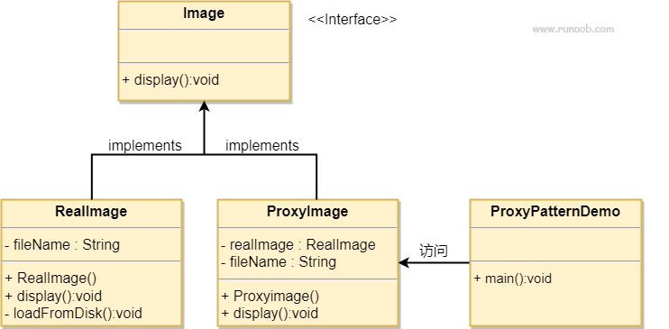

# 代理模式

在代理模式（Proxy Pattern）中，一个类代表另一个类的功能。这种类型的设计模式属于结构型模式。

在代理模式中，我们创建具有现有对象的对象，以便向外界提供功能接口。

## 一、介绍

**意图：**为其他对象提供一种代理以控制对这个对象的访问。

**主要解决：**在直接访问对象时带来的问题，比如说：要访问的对象在远程的机器上。在面向对象系统中，有些对象由于某些原因（比如对象创建开销很大，或者某些操作需要安全控制，或者需要进程外的访问），直接访问会给使用者或者系统结构带来很多麻烦，我们可以在访问此对象时加上一个对此对象的访问层。

**何时使用：**想在访问一个类时做一些控制。

**如何解决：**增加中间层。

**关键代码：**<font style="background:yellow">实现与被代理类组合。</font>

**应用实例：** 1、Windows 里面的快捷方式。 2、猪八戒去找高翠兰结果是孙悟空变的，可以这样理解：把高翠兰的外貌抽象出来，高翠兰本人和孙悟空都实现了这个接口，猪八戒访问高翠兰的时候看不出来这个是孙悟空，所以说孙悟空是高翠兰代理类。 3、买火车票不一定在火车站买，也可以去代售点。 4、一张支票或银行存单是账户中资金的代理。支票在市场交易中用来代替现金，并提供对签发人账号上资金的控制。 5、spring aop。

**优点：** 1、职责清晰。 2、高扩展性。 3、智能化。

**缺点：** 1、由于在客户端和真实主题之间增加了代理对象，因此有些类型的代理模式可能会造成请求的处理速度变慢。 2、实现代理模式需要额外的工作，有些代理模式的实现非常复杂。

**使用场景：**按职责来划分，通常有以下使用场景： 1、远程代理。 2、虚拟代理。 3、Copy-on-Write 代理。 4、保护（Protect or Access）代理。 5、Cache代理。 6、防火墙（Firewall）代理。 7、同步化（Synchronization）代理。 8、智能引用（Smart Reference）代理。

**注意事项：** 1、和适配器模式的区别：适配器模式主要改变所考虑对象的接口，而代理模式不能改变所代理类的接口。 2、和装饰器模式的区别：装饰器模式为了增强功能，而代理模式是为了加以控制。

## 二、实现（静态代理）

我们将创建一个 *Image* 接口和实现了 *Image* 接口的实体类。*ProxyImage* 是一个代理类，减少 *RealImage* 对象加载的内存占用。

*ProxyPatternDemo* 类使用 *ProxyImage* 来获取要加载的 *Image* 对象，并按照需求进行显示。



### 步骤 1

创建一个接口。

```java
public interface Image {
   void display();
}
```

### 步骤 2

创建实现接口的实体类。

```java
public class RealImage implements Image {
 
   private String fileName;
 
   public RealImage(String fileName){
      this.fileName = fileName;
      loadFromDisk(fileName);
   }
 
   @Override
   public void display() {
      System.out.println("Displaying " + fileName);
   }
 
   private void loadFromDisk(String fileName){
      System.out.println("Loading " + fileName);
   }
}

```

### 步骤 3

创建实现接口的实体类的静态代理类。

```java
public class ProxyImage implements Image{
 
   private RealImage realImage;
   private String fileName;
 
   public ProxyImage(String fileName){
      this.fileName = fileName;
   }
 
   @Override
   public void display() {
      if(realImage == null){
         realImage = new RealImage(fileName);
      }
      //代理前操作
      System.out.println("display before....");
      realImage.display();
      //代理后操作
      System.out.println("display after....");
   }
}
```

### 步骤 4

当被请求时，使用 *ProxyImage* 来获取 *RealImage* 类的对象。

```java
public class ProxyPatternDemo {
   
   public static void main(String[] args) {
      Image image = new ProxyImage("test_10mb.jpg");
      // 图像将从磁盘加载
      image.display(); 
      System.out.println("");
      // 图像不需要从磁盘加载
      image.display();  
   }
}
```

### 步骤 5

执行程序，输出结果：

```java
Loading test_10mb.jpg
display before....
Displaying test_10mb.jpg
display after....

display before....
Displaying test_10mb.jpg
display after....

```

## 三、实现（动态代理）

### 步骤 1

创建一个接口。

```java
public interface Image {
   void display();
}
```

### 步骤 2

创建实现接口的实体类。

```java
public class RealImage implements Image {
 
   private String fileName;
 
   public RealImage(String fileName){
      this.fileName = fileName;
      loadFromDisk(fileName);
   }
 
   @Override
   public void display() {
      System.out.println("Displaying " + fileName);
   }
 
   private void loadFromDisk(String fileName){
      System.out.println("Loading " + fileName);
   }
}
```

### 步骤 3

当被请求时，使用 *动态代理* 来调用 *RealImage* 类的对象。

```java
public class ProxyPatternDemo {
   
   public static void main(String[] args) {
       //Proxy实现----代理类需要有接口
      Image imageProxy = (Image) Proxy.newProxyInstance(RealImage.class.getClassLoader(), new Class[]{Image.class}, new InvocationHandler() {

            private Image image = new RealImage("test_11mb.jpg");

            @Override
            public Object invoke(Object proxy, Method method, Object[] args) throws Throwable {
                System.out.println("display before....");
                Object o = method.invoke(image, args);
                System.out.println("display after....");
                return o;
            }
        });
        imageProxy.display();
        System.out.println("");
        imageProxy.display();
       //cglib实现----代理类不需要有接口
//        Enhancer enhancer = new Enhancer();
//        enhancer.setSuperclass(RealImage.class);
//        enhancer.setCallback(new MethodInterceptor() {
//            @Override
//            public Object intercept(Object o, Method method, Object[] objects, MethodProxy methodProxy) throws Throwable {
//                System.out.println("display before....");
//                Object result = methodProxy.invokeSuper(o, objects);
//                System.out.println("display after....");
//                return result;
//            }
//        });
//        RealImage o = (RealImage) enhancer.create(new Class[]{String.class},new Object[]{"test_12mb.jpg"});
//        o.display();
//        System.out.println();
//        o.display();
   }
}
```

### 步骤 4

执行程序，输出结果：

```java
//Proxy实现
Loading test_11mb.jpg
display before....
Displaying test_11mb.jpg
display after....

display before....
Displaying test_11mb.jpg
display after....

//cglib实现
//Loading test_11mb.jpg
//display before....
//Displaying test_11mb.jpg
//display after....

//display before....
//Displaying test_11mb.jpg
//display after....  
```

## 四、静态代理模式和装饰器模式区别

对装饰器模式来说，装饰者（Decorator）和被装饰者（Decoratee）都实现一个接口。对代理模式来说，代理类（Proxy Class）和真实处理的类（Real Class）都实现同一个接口。此外，<font style="background:yellow">不论我们使用哪一个模式，都可以很容易地在真实对象的方法前面或者后面加上自定义的方法。</font>

在上面的例子中，装饰器模式是使用的调用者从外部传入的被装饰对象（coffee），调用者只想要你把他给你的对象装饰（加强）一下。而代理模式使用的是代理对象在自己的构造方法里面new的一个被代理的对象，不是调用者传入的。调用者不知道你找了其他人，他也不关心这些事，只要你把事情做对了即可。

装饰器模式关注于在一个对象上动态地添加方法，而代理模式关注于控制对对象的访问。换句话说，用代理模式，代理类可以对它的客户隐藏一个对象的具体信息。因此<font style="background:yellow">当使用代理模式的时候，我们常常在一个代理类中创建一个对象的实例；当使用装饰器模式的时候，我们通常的做法是将原始对象作为一个参数传给装饰器的构造器。</font>

装饰器模式和代理模式的使用场景不一样，比如IO流使用的是装饰者模式，可以层层增加功能。而代理模式则一般是用于增加特殊的功能，有些动态代理不支持多层嵌套。

代理和装饰其实从另一个角度更容易去理解两个模式的区别：代理更多的是强调对对象的访问控制，比如说，访问A对象的查询功能时，访问B对象的更新功能时，访问C对象的删除功能时，都需要判断对象是否登陆，那么我需要将判断用户是否登陆的功能抽提出来，并对A对象、B对象和C对象进行代理，使访问它们时都需要去判断用户是否登陆，简单地说就是将某个控制访问权限应用到多个对象上；而装饰器更多的强调给对象加强功能，比如说要给只会唱歌的A对象添加跳舞功能，添加说唱功能等，简单地说就是将多个功能附加在一个对象上。

所以，代理模式注重的是对对象的某一功能的流程把控和辅助，它可以控制对象做某些事，重心是为了借用对象的功能完成某一流程，而非对象功能如何。而装饰模式注重的是对对象功能的扩展，不关心外界如何调用，只注重对对象功能加强，装饰后还是对象本身。

### 总结

对于代理类，如何调用对象的某一功能是思考重点，而不需要兼顾对象的所有功能；对于装饰类，如何扩展对象的某一功能是思考重点，同时也需要兼顾对象的其他功能，因为再怎么装饰，本质也是对象本身，要担负起对象应有的职责，被装饰者的职责一旦增加，作为装饰类也需要有相应的扩展，必然会造成编码的负担。

> 设计模式本身是为了提升代码的可扩展性，灵活应用即可，不必生搬硬套，非要分出个所以然来，装饰器模式和代理模式的区别也是如此。

## 五.【继承】、【装饰者模式】、【动态代理模式】之间的比较

|        | 继承                     | 装饰者模式               | 动态代理模式             |
| :----- | :----------------------- | :----------------------- | :----------------------- |
| 作用   | 增加功能（给x添加y功能） | 增加功能（给x添加y功能） | 增加功能（给x添加y功能） |
| 优点   |                          | x可变                    | x和y都可变               |
| 缺点   | x和y都不可变             | y不可变                  |                          |
| 灵活性 | 低                       | 中                       | 高                       |

参考文档：

[装饰器模式和代理模式的区别](https://www.cnblogs.com/yanggb/p/10952843.html)

[对象的功能扩展方式（继承、装饰者设计模式、动态代理设计模式）](https://blog.csdn.net/weixin_42425970/article/details/84259635?spm=1001.2101.3001.6661.1&utm_medium=distribute.pc_relevant_t0.none-task-blog-2%7Edefault%7ECTRLIST%7ERate-1.pc_relevant_paycolumn_v3&depth_1-utm_source=distribute.pc_relevant_t0.none-task-blog-2%7Edefault%7ECTRLIST%7ERate-1.pc_relevant_paycolumn_v3&utm_relevant_index=1)