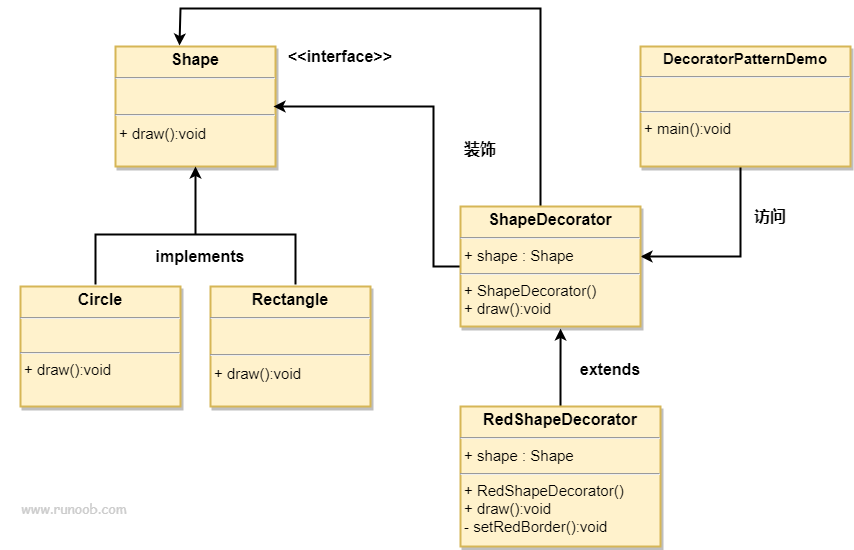

# 装饰器模式

装饰器模式（Decorator Pattern）允许向一个现有的对象添加新的功能，同时又不改变其结构。这种类型的设计模式属于结构型模式，它是作为现有的类的一个包装。

这种模式创建了一个装饰类，用来包装原有的类，并在保持类方法签名完整性的前提下，提供了额外的功能。

我们通过下面的实例来演示装饰器模式的用法。其中，我们将把一个形状装饰上不同的颜色，同时又不改变形状类。

## 一、介绍

**意图：**动态地给一个对象添加一些额外的职责。就增加功能来说，装饰器模式相比生成子类更为灵活。

**主要解决：**一般的，我们为了扩展一个类经常使用继承方式实现，由于继承为类引入静态特征，并且随着扩展功能的增多，子类会很膨胀。

**何时使用：**在不想增加很多子类的情况下扩展类。

**如何解决：**将具体功能职责划分，同时继承装饰者模式。

**关键代码：** 1、Component 类充当抽象角色，不应该具体实现。 2、修饰类引用和继承 Component 类，具体扩展类重写父类方法。

**应用实例：** 1、孙悟空有 72 变，当他变成"庙宇"后，他的根本还是一只猴子，但是他又有了庙宇的功能。 2、不论一幅画有没有画框都可以挂在墙上，但是通常都是有画框的，并且实际上是画框被挂在墙上。在挂在墙上之前，画可以被蒙上玻璃，装到框子里；这时画、玻璃和画框形成了一个物体。

**优点：**装饰类和被装饰类可以独立发展，不会相互耦合，装饰模式是继承的一个替代模式，装饰模式可以动态扩展一个实现类的功能。

**缺点：**多层装饰比较复杂。

**使用场景：** 1、扩展一个类的功能。 2、动态增加功能，动态撤销。

**注意事项：**可代替继承。

## 二、实现

我们将创建一个 *Shape* 接口和实现了 *Shape* 接口的实体类。然后我们创建一个实现了 *Shape* 接口的抽象装饰类 *ShapeDecorator*，并把 *Shape* 对象作为它的实例变量。

*RedShapeDecorator* 是实现了 *ShapeDecorator* 的实体类。

*DecoratorPatternDemo* 类使用 *RedShapeDecorator* 来装饰 *Shape* 对象。



**步骤 1**

```java
public interface Shape {
   void draw();
}
```

**步骤 2**

```java
public class Rectangle implements Shape {
 
   @Override
   public void draw() {
      System.out.println("Shape: Rectangle");
   }
}
```

```java
public class Circle implements Shape {
 
   @Override
   public void draw() {
      System.out.println("Shape: Circle");
   }
}
```

**步骤 3**

创建实现了 *Shape* 接口的抽象装饰类。

```java
public abstract class ShapeDecorator implements Shape {
   protected Shape decoratedShape;
 
   public ShapeDecorator(Shape decoratedShape){
      this.decoratedShape = decoratedShape;
   }
 
   public void draw(){
      decoratedShape.draw();
   }  
}
```

**步骤 4**

创建扩展了 *ShapeDecorator* 类的实体装饰类。

```java
public class RedShapeDecorator extends ShapeDecorator {
 
   public RedShapeDecorator(Shape decoratedShape) {
      super(decoratedShape);     
   }
 
   @Override
   public void draw() {
      decoratedShape.draw();         
      setRedBorder(decoratedShape);
   }
 
   private void setRedBorder(Shape decoratedShape){
      System.out.println("Border Color: Red");
   }
}
```

**步骤 5**

使用 *RedShapeDecorator* 来装饰 *Shape* 对象。

```java
public class DecoratorPatternDemo {
   public static void main(String[] args) {
 
      Shape circle = new Circle();
      ShapeDecorator redCircle = new RedShapeDecorator(new Circle());
      ShapeDecorator redRectangle = new RedShapeDecorator(new Rectangle());
      //Shape redCircle = new RedShapeDecorator(new Circle());
      //Shape redRectangle = new RedShapeDecorator(new Rectangle());
      System.out.println("Circle with normal border");
      circle.draw();
 
      System.out.println("\nCircle of red border");
      redCircle.draw();
 
      System.out.println("\nRectangle of red border");
      redRectangle.draw();
   }
}
```

**步骤 6**

执行程序，输出结果：

```java
Circle with normal border
Shape: Circle

Circle of red border
Shape: Circle
Border Color: Red

Rectangle of red border
Shape: Rectangle
Border Color: Red
```

