# CentOS 7虚拟机安装后

## 一、新建虚拟机

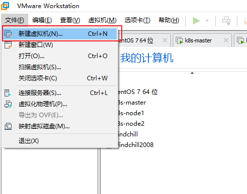

### 1、选择典型

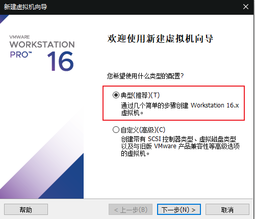

### 2、选择CentOS镜像

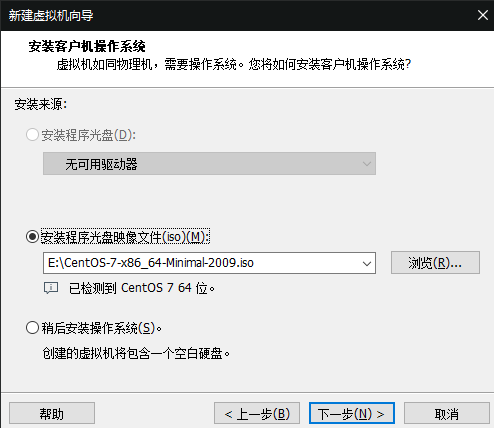

### 3、选择存储位置

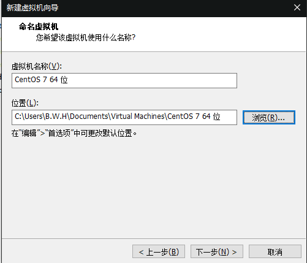

### 4、虚拟机磁盘配置

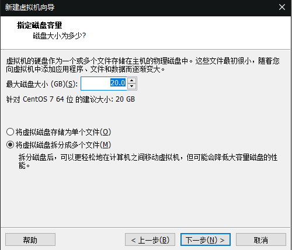

### 5、自定义其他配置

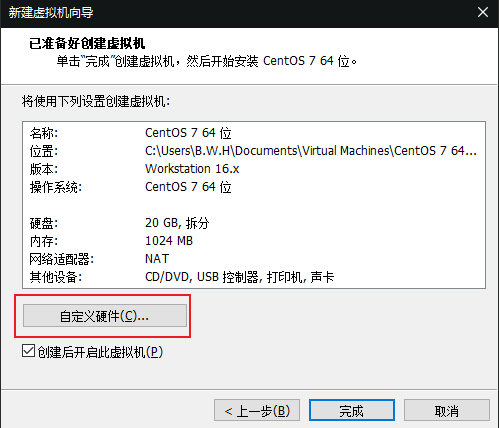

## 二、系统安装

### 1、虚拟机配置完成之后进入系统安装界面

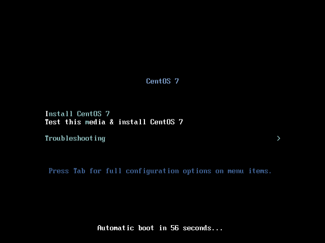

出现此界面后敲“回车”进入安装程序

### 2、选择安装语言

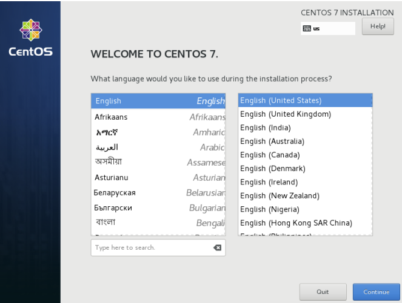

### 3、分区选择

虽然默认会自动帮我们格式化磁盘，但也需要点击确认一下

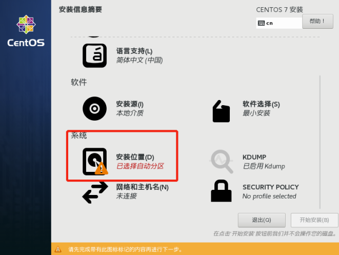

点击左上角完成即可

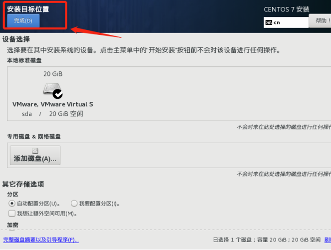

### 4、开始安装

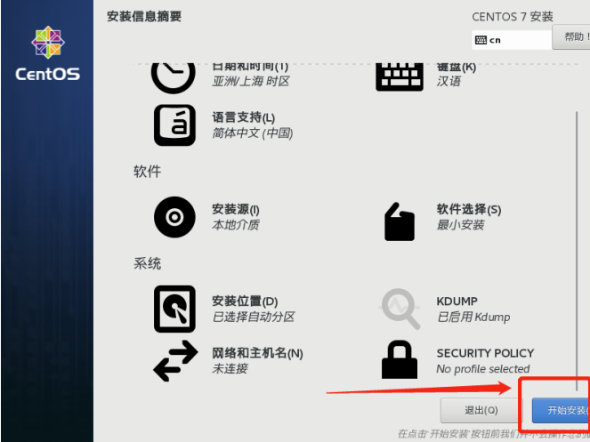

安装过程中我们可以设置密码

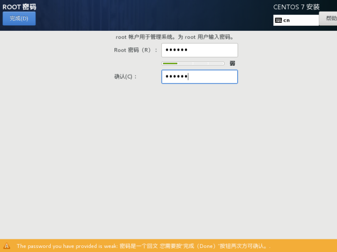

### 5、安装完成

 当出现“重启”按钮时，说明系统已经安装完成

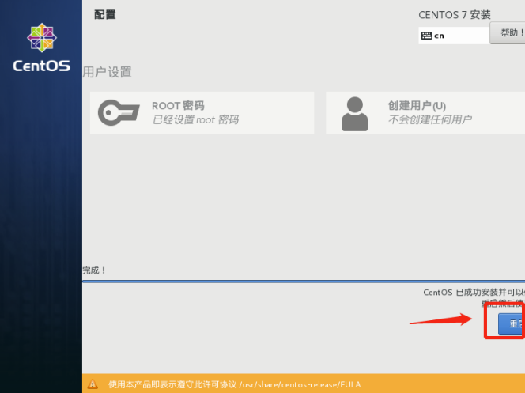

重启后的样子


至此，我们在VMware中对CentOS的基本安装已经完成

## 三、Linux配置

配置上网

- 修改配置网卡配置文件

```shell
vi /etc/sysconfig/network-scripts/ifcfg-ens33	
```

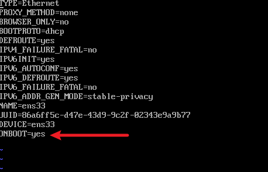

- 修改 `ONBOOT=yes`

- 重启网络服务

```shell
systemctl restart network
```

至此，我们的虚拟机就可以访问互联网了。