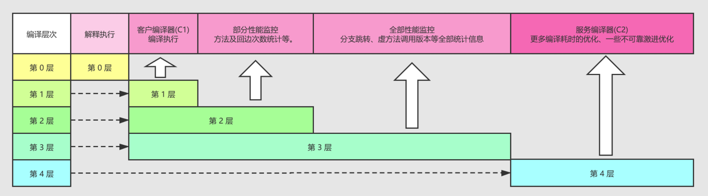
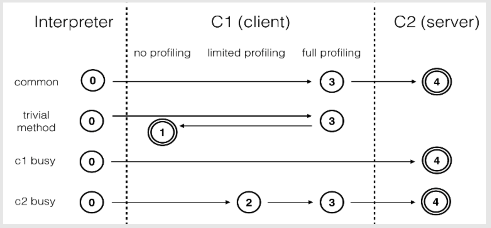

笔记来源：

[https://blog.csdn.net/u013490280/article/details/108522427](https://blog.csdn.net/u013490280/article/details/108522427)

# HotSpot虚拟机的分层编译（Tiered Compilation）

## 一、基本概念名词用于 HotSpot 虚拟机中。

- 提前编译（Ahead Of Time，AOT）
- 即时编译（Just In TIme，JIT）
- 解释器（Interpreter）
- 编译器（Compiler）
- 客户端编译器（Client Compiler，C1）
- 服务端编译器（Server Compiler，C2，也叫Opto编译器）
- Graal编译器（JDK 10 出现用于替代 C2）
- 混合模式（Mixed Mode）默认
- 解释模式（Interpreted Mode）-Xint
- 编译模式（Compiled Mode）-Xcomp

Java 程序最初都是通过**解释器进行解释执行的**，当虚拟机发现某个方法或者代码块的执行特别频繁，就会把这些代码认定为 “ **热点代码** ”（Hot Spot Code），为了提高热点代码的执行效率，在运行时，虚拟机将会把这些代码编译成本地机器码，并以各种手段尽可能地进行代码优化，运行时完成这个任务的后端编译器被称为**即时编译器**。

**解释执行**：启动速度快。
**C1 编译执行**：预热较快，运行时，执行快，相对更高的编译速度。
**C2 编译执行**：需要较慢，运行时，执行快，相对更好的编译质量。

## 二、分层编译

在分层编译的工作模式出现前，HotSpot 虚拟机通常时采用解释器与其中一个编译器直接搭配的方式工作。为了在程序启动相应速度与运行效率之间达到最佳平衡，HotSpot 虚拟机在编译子系统中加入了分层编译功能。

JDK 6 时初步实现，JDK 7 开始服务端模式虚拟机中作为默认编译策略被开启。

java -XX:+PrintFlagsFinal 可以查看到 `TieredCompilation` 默认打开

综合了 C1 的高启动性能及 C2 的高峰值性能。这两个 JIT compiler 以及 interpreter 将 HotSpot 的执行方式划分为五个级别：

- level 0：interpreter 解释执行。
- level 1：C1 编译，无 profiling（性能监控）
- level 2：C1 编译，仅方法及循环 back-edge 执行次数的 profiling
- level 3：C1 编译，除 level 2 中的 profiling 外还包括 branch（针对分支跳转字节码）及 receiver type（针对成员方法调用或类测，如 checkcast，instnaceof，aastore 字节码）的 profiling
- level 4：C2 编译

## 三、分层编译的交互关系

> 上图列举了4 种编译模式（非全部）。
>
> * 通常情况下，一个方法先被解释执行（level 0），然后被C1 编译（level 3），再然后被得到profile 数据的C2 编译（level 4）。
>
> - 如果编译对象非常简单，虚拟机认为通过C1 编译或通过C2 编译并无区别，便会直接由C1 编译且不插入profiling 代码（level 1）。
>
> - 在C1 忙碌的情况下，interpreter 会触发profiling，而后方法会直接被C2 编译；
>
> - 在C2 忙碌的情况下，方法则会先由C1 编译并保持较少的profiling（level 2），以获取较高的执行效率（与3 级相比高30%）。

