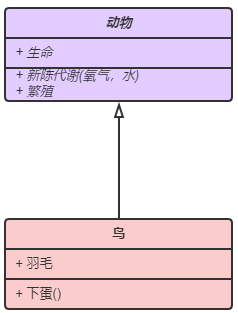
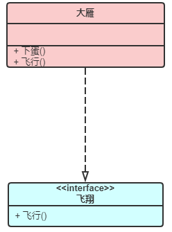
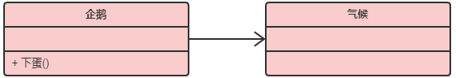
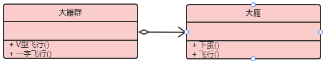
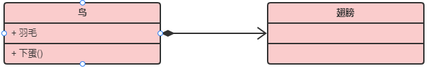
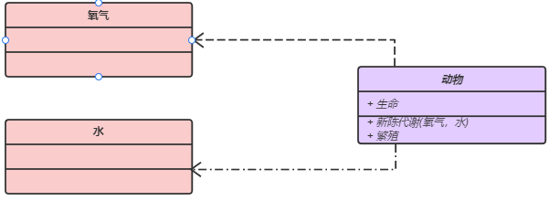
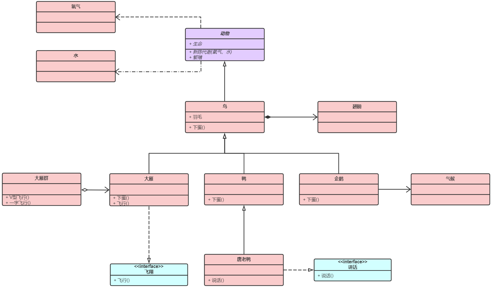

笔记来源：

[https://blog.csdn.net/tianhai110/article/details/6339565](https://blog.csdn.net/tianhai110/article/details/6339565)

[https://www.jianshu.com/p/57620b762160](https://www.jianshu.com/p/57620b762160)

# UML类图

## 1. 类图基础属性


```
+表示public
-表示private  
#表示protected 
~表示default,也就是包权限  
_下划线表示static  
斜体表示抽象
```

## 2. 类与类之间关系

在UML类图中，常见的有以下几种关系：

**泛化（*Generalization*），**

**实现（*Realization*），**

**关联（*Association*），**

**聚合（*Aggregation*），**

**组合（*Composition*），**

**依赖（*Dependency*）**

### 2.1 泛化（*Generalization*）

<font color='red'>【泛化关系】：是一种继承关系,它指定了子类如何特化父类的所有特征和行为。</font>例如：老虎是动物的一种。

<font color='blue'>【箭头指向】：带三角箭头的实线，箭头指向父类。</font>

【示例】：鸟类继承抽象类动物



### 2.2 实现（*Realization*）

<font color='red'>【实现关系】：是一种类与接口的关系，表示类是接口所有特征和行为的实现。</font>

<font color='blue'>【箭头指向】：带三角箭头的虚线，箭头指向接口。</font>

【示例】：大雁需要飞翔，就要实现飞行的行为




### 2.3 关联（*Association*）

<font color='red'>【关联关系】：对于两个相对独立的对象，当一个对象的实例与另一个对象的一些特定实例存在固定的对应关系时，这两个对象之间为关联关系。</font>

关联可以是双向的，也可以是单向的。双向的关联可以有两个箭头或者没有箭头，单向的关联有一个箭头。

<font color='blue'>【箭头指向】：带普通箭头的实心线，指向被拥有者。</font>

【示例】：企鹅需要`知道`气候的变化，需要`了解`气候规律。当一个类`知道`另一个类时，可以用关联。



### 2.4 聚合（*Aggregation*）

<font color='red'>【聚合关系】：表示一种弱的‘拥有’关系，即has-a的关系，体现的是A对象可以包含B对象，但B对象不是A对象的一部分。 **两个对象具有各自的生命周期**。</font>

<font color='blue'>【箭头指向】：带空心菱形的实心线，菱形指向整体。</font>

【示例】：每一只大雁都属于一个大雁群，一个大雁群可以有多只大雁。当大雁死去后大雁群并不会消失，两个对象生命周期不同。



### 2.5 组合（*Composition*）

<font color='red'>【组合关系】：组合是一种强的‘拥有’关系，是一种contains-a的关系，体现了严格的部分和整体关系，**部分和整体的生命周期一样**。</font>

<font color='blue'>【箭头指向】：带实心菱形的实心线，菱形指向整体。</font>

【示例】：鸟和翅膀就是组合关系，因为它们是部分和整体的关系，并且翅膀和鸟的生命周期是相同的。



### 2.6 依赖（*Dependency*）

<font color='red'>【依赖关系】：对于两个相对独立的对象，当一个对象负责构造另一个对象的实例，或者依赖另一个对象的服务时，这两个对象之间主要体现为依赖关系。</font>

> ​	尽量不使用双向的互相依赖

<font color='green'>【代码表现】：局部变量、方法的参数或者对静态方法的调用。</font>

<font color='blue'>【箭头指向】：带箭头的虚线，指向被使用者。</font>

【示例】：动物依赖氧气和水。调用新陈代谢方法需要氧气类与水类的实例作为参数。



## 3.各种关系的强弱顺序

**<font size='5'>泛化=实现>组合>聚合>关联>依赖</font>**

下面这张UML图，比较形象地展示了各种类图关系：



