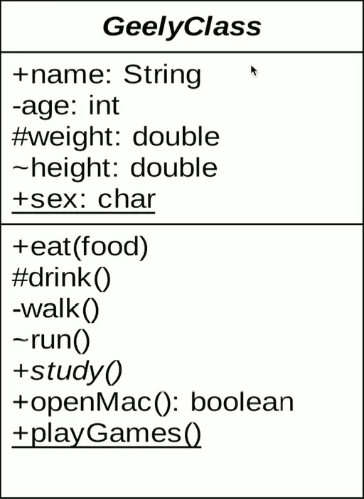
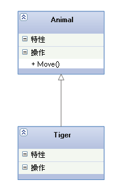

[笔记来源：https://blog.csdn.net/tianhai110/article/details/6339565](https://blog.csdn.net/tianhai110/article/details/6339565)

# UML类图

## 1.类图基础属性



```
+表示public
-表示private  
#表示protected 
~表示default,也就是包权限  
_下划线表示static  
斜体表示抽象
```

## 2.类与类之间关系

在UML类图中，常见的有以下几种关系：

**泛化（*Generalization*），**

**实现（*Realization*），**

**关联（*Association*），**

**聚合（*Aggregation*），**

**组合（*Composition*），**

**依赖（*Dependency*）**

### 2.1泛化

<font color='red'>【泛化关系】：是一种继承关系,它指定了子类如何特化父类的所有特征和行为。</font>

​	例如：老虎是动物的一种。

