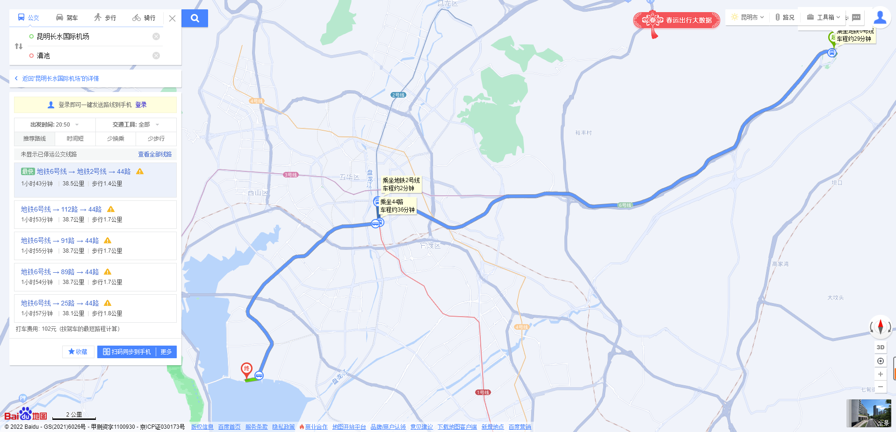

# 昆明-大理-丽江（旅行攻略）

## 一、交通工具

长沙->昆明：300元左右(飞机)1天  

昆明->大理：155元左右（高铁 2~3小时）

大理->丽江：80元左右  （高铁 2~3小时）3月3号下午-3月5号下午

丽江->长沙：480元左右  3月5号晚上

**长沙->昆明->大理->丽江->长沙**  629+290+160+1100

### 住宿

大理：251+200

昆明：3月1号上午-3月1号晚上

大理：3月2号凌晨-3月3号下午

丽江：3月3号晚上-3月5号下午

## 二、路线

### 昆明

滇池

石林风景区

住宿

### 大理

[洱海](http://www.mafengwo.cn/poi/956.html)(1-3小时)  [海舌生态公园](http://www.mafengwo.cn/poi/8469388.html)(1-3小时)  [喜洲古镇](http://www.mafengwo.cn/poi/952.html)(1-3小时)  [双廊古镇](http://www.mafengwo.cn/poi/17386.html)(1-3小时)  [小普陀](http://www.mafengwo.cn/poi/47799.html)(1-3小时)  

http://www.mafengwo.cn/mdd/cityroute/10487_110400.html

### 丽江

http://www.mafengwo.cn/mdd/cityroute/10186_272.html

http://www.mafengwo.cn/mdd/route/10487_316.html